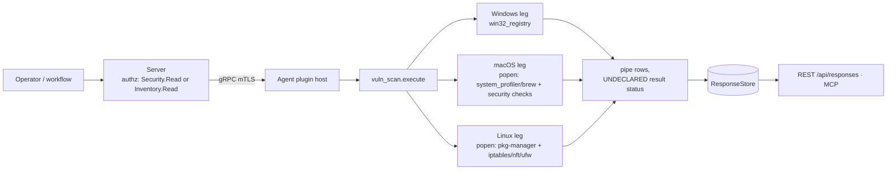

# vuln_scan

<!-- BEGIN GENERATED: plugin-doc-gen header -->
| | |
|---|---|
| **What it does** | Host vulnerability scanning — CVE matching and configuration compliance checks |
| **Version** | 1.0.0 |
| **Kind** | Collector · read-only · gathered (security.vuln_scan.scan, security.vuln_scan.cve_scan, security.vuln_scan.config_scan, security.vuln_scan.summary, security.vuln_scan.inventory) |
| **Platforms** | Windows ✅ · macOS ✅ · Linux ✅ |
| **Actions** | `config_scan` (definition `security.vuln_scan.config_scan`) · `cve_scan` (definition `security.vuln_scan.cve_scan`) · `inventory` (definition `security.vuln_scan.inventory`) · `scan` (definition `security.vuln_scan.scan`) · `summary` (definition `security.vuln_scan.summary`) |
| **Security** | `scan`: securable `Security` · operation Read · risk Low · dispatch ReadOnly · approval gate None; `cve_scan`: securable `Security` · operation Read · risk Low · dispatch ReadOnly · approval gate None; `config_scan`: securable `Security` · operation Read · risk Low · dispatch ReadOnly · approval gate None; `summary`: securable `Security` · operation Read · risk Low · dispatch ReadOnly · approval gate None; `inventory`: securable `Inventory` · operation Read · risk Low · dispatch ReadOnly · approval gate None |
| **Roles** | execute: endpoint-admin, endpoint-operator, security-admin · author: content-author |
<!-- END GENERATED -->

## How it works

Every action is a read. `scan` runs the CVE match (`do_cve_scan_impl`) then the configuration
compliance checks (`do_config_scan_impl`), reporting progress at 0/50/90/100, and emits the union
of both as findings. `cve_scan` and `config_scan` are `scan`'s two halves in isolation — CVE
matching only, or configuration checks only. `summary` runs the same combined scan as `scan` but
discards the individual findings and emits only per-severity counts plus a `TOTAL` row. `inventory`
runs neither scan: it enumerates installed software and returns raw `name|version` pairs with no
CVE or configuration logic at all.

CVE matching is a fixed, built-in table of software rules matched by case-insensitive product-name
substring against a naive dot/dash-split numeric version comparator — it is deliberately not a
connection to a live vulnerability feed. `inventory` exists specifically to hand raw software
identity to the server for a heavier, centralized match instead: its own definition describes it as
"a lightweight alternative to client-side CVE scanning that enables the server to perform
centralized vulnerability correlation against the full NVD database".



## OS capability

<!-- BEGIN GENERATED: plugin-doc-gen capability -->
| Action | Windows | macOS | Linux |
|---|---|---|---|
| `config_scan` | ✅ supported · rung 1 · win32_registry | ✅ supported · rung 3 · popen(spctl/fdesetup/csrutil/socketfilterfw) | ✅ supported · rung 3 · popen(iptables/nft/ufw)+procfs |
| `cve_scan` | ✅ supported · rung 1 · win32_registry | ✅ supported · rung 3 · popen(system_profiler/brew) | ✅ supported · rung 3 · popen(dpkg-query/rpm/pacman/apk) |
| `inventory` | ✅ supported · rung 1 · win32_registry | ✅ supported · rung 3 · popen(system_profiler/brew) | ✅ supported · rung 3 · popen(dpkg-query/rpm/pacman/apk) |
| `scan` | ✅ supported · rung 1 · win32_registry | ✅ supported · rung 3 · popen(system_profiler/brew+security-checks) | ✅ supported · rung 3 · popen(pkg-manager+iptables/nft/ufw) |
| `summary` | ✅ supported · rung 1 · win32_registry | ✅ supported · rung 3 · popen(system_profiler/brew+security-checks) | ✅ supported · rung 3 · popen(pkg-manager+iptables/nft/ufw) |
<!-- END GENERATED -->

## Privileges and prerequisites

| OS | Runs as | Extra grant needed | Measured | If the read is refused |
|---|---|---|---|---|
| Windows | agent daemon identity (captured as `SYSTEM`) | not established — no `docs/agent-privilege-model.md` row for this plugin | 2026-09-07, bare metal, as SYSTEM | not observed in this capture; a denied `RegOpenKeyExW`/`RegQueryValueExW` fails silently and the read helper returns an empty string, so a blocked registry read surfaces as the check's default branch, not an explicit error |
| macOS | agent daemon (captured unprivileged, euid 501) | not established — no privilege-model row | 2026-09-07, bare metal, euid 501 (alex) | not observed; a failed `popen` command (`spctl`/`fdesetup`/`csrutil`/`socketfilterfw`) returns empty output, which every check parses as its negative/disabled branch |
| Linux | agent daemon (captured as root, euid 0, container) | not established — no privilege-model row | 2026-09-06, container, euid 0 | not observed; a failed `popen` call or unreadable file returns empty, parsed as the check's negative/default branch |

No external binaries on Windows — both software enumeration and the Windows config checks are
direct `Reg*W` calls, no subprocess. Linux and macOS shell out via `popen`/`system()` to: Linux —
`dpkg-query`, `rpm`, `pacman`, `apk` (whichever is present), `iptables`, `nft`, `ufw`, and
`ss`/`netstat`; macOS — `system_profiler`, optionally `brew`, and `spctl`, `fdesetup`, `csrutil`,
`socketfilterfw`, `systemsetup`, `defaults`, and `ss`/`netstat`. No outbound network access — the
firewall and `ss`/`netstat` commands query local host state only.

## Data contract

### Inputs

<!-- BEGIN GENERATED: plugin-doc-gen inputs -->
No action takes parameters.
<!-- END GENERATED -->

### Outputs

Pipe-delimited rows, one per finding (or per installed package for `inventory`). `scan`,
`cve_scan`, and `config_scan` share the same 4-field row shape,
`severity|category|title|detail`; an empty result is never zero rows — a run that finds nothing
still emits one placeholder row, `INFO|scan|No vulnerabilities|No issues detected`. `summary` emits
a different, 3-field shape: a literal `summary` discriminator, then a severity name (or the
literal `TOTAL`), then a count — one field more than the two result columns (`severity`, `count`)
the definition declares. `inventory` emits raw `name|version` pairs with no discriminator.

<!-- BEGIN GENERATED: plugin-doc-gen outputs -->
**`security.vuln_scan.config_scan` — `severity|category|title|detail`**

| Field | Type | Values | Available | Example | Description |
|---|---|---|---|---|---|
| `severity` | string | `CRITICAL` `HIGH` `MEDIUM` `LOW` `INFO` | Windows, Linux, macOS | `HIGH` | Finding severity assigned by the compliance check that produced this row. |
| `category` | string | `config` `scan` | Windows, Linux, macOS | `config` | Always "config" for this action; "scan" only on the placeholder row emitted when there is nothing to report. |
| `title` | string | - | Windows, Linux, macOS | `SMBv1 Protocol` | The name of the compliance check, e.g. the setting it inspects. Values: free text. |
| `detail` | string | - | Windows, Linux, macOS | `Enabled - vulnerable to EternalBlue/WannaCry (MS17-010)` | The check's human-readable result text, including why a failing check failed. Values: free text. |

**`security.vuln_scan.cve_scan` — `severity|category|title|detail`**

| Field | Type | Values | Available | Example | Description |
|---|---|---|---|---|---|
| `severity` | string | `CRITICAL` `HIGH` `MEDIUM` `LOW` `INFO` | Windows, Linux, macOS | `HIGH` | Finding severity assigned by the CVE rule that matched. |
| `category` | string | `cve` `scan` | Windows, Linux, macOS | `cve` | Always "cve" for a match; "scan" on the single placeholder row emitted when nothing matches. |
| `title` | string | - | Windows, Linux, macOS | `CVE-2023-24329: urllib.parse URL parsing bypass via leading whitespace` | "<CVE-ID>: <description>" from the matched rule, or "No vulnerabilities" on the placeholder row. Values: free text. |
| `detail` | string | - | Windows, Linux, macOS | `Python 3.9.6 (fixed in 3.11.4)` | <installed product> <version> (fixed in <fixed_ver>). Values: free text. |

**`security.vuln_scan.inventory` — `name|version`**

| Field | Type | Values | Available | Example | Description |
|---|---|---|---|---|---|
| `name` | string | - | Windows, Linux, macOS | `curl` | Installed application or package name, as reported by the OS's own inventory source. Values: free text. |
| `version` | string | - | Windows, Linux, macOS | `8.14.1-2+deb13u4` | Installed version string, or empty when the source reports none (e.g. a Windows uninstall entry with no DisplayVersion). Values: free text, or empty. |

**`security.vuln_scan.scan` — `severity|category|title|detail`**

| Field | Type | Values | Available | Example | Description |
|---|---|---|---|---|---|
| `severity` | string | `CRITICAL` `HIGH` `MEDIUM` `LOW` `INFO` | Windows, Linux, macOS | `CRITICAL` | Finding severity assigned by the check that produced this row. |
| `category` | string | `cve` `config` `scan` | Windows, Linux, macOS | `cve` | Which half of the scan produced this row. |
| `title` | string | - | Windows, Linux, macOS | `CVE-2021-34527: PrintNightmare: RCE via Windows Print Spooler` | For a cve row, "<CVE-ID>: <description>" from the matched rule; for a config row, the name of the compliance check; "No vulnerabilities" on the single placeholder row emitted when a run finds nothing. Values: free text. |
| `detail` | string | - | Windows, Linux, macOS | `Microsoft Windows Desktop Runtime - 6.0.11 (x64) 6.0.11.31823 (fixed in KB5004945)` | For a cve row, "<installed product> <version> (fixed in <fixed_ver>)"; for a config row, the check's human-readable result text. Values: free text. |

**`security.vuln_scan.summary` — `severity|count`**

| Field | Type | Values | Available | Example | Description |
|---|---|---|---|---|---|
| `severity` | string | `TOTAL` `CRITICAL` `HIGH` `MEDIUM` `LOW` `INFO` | Windows, Linux, macOS | `CRITICAL` | The severity this row counts, or the literal "TOTAL" for the first row emitted by every run. |
| `count` | int32 | - | Windows, Linux, macOS | `17` | The number of findings at this severity. The TOTAL row is an exception: despite the declared int32 type, that row's cell holds the formatted string "<n> findings (<n> issues)", not an integer. Values: integer, except a formatted string on the TOTAL row. |
<!-- END GENERATED -->

### Result status

This plugin does not set a typed result status; the agent records `UNDECLARED` and the sample
shows `UNDECLARED / UNKNOWN /` on every action, on every OS.

### Where the data goes

- **Instruction result only.** Rows travel over the agent's mTLS gRPC channel as the command
  response and land in the ResponseStore, rendered by the dashboard/REST using either the
  plugin's default column schema (`Agent, Severity, Category, Title, Detail`) or, when the
  request carries a definition id, the definition's own YAML result-column schema.
- **Server-side NVD matching.** `inventory`'s own definition states its data is for
  "server-side NVD matching" and "centralized vulnerability correlation against the full NVD
  database"; the server's independent version-comparison code notes it duplicates "the same
  algorithm as agents/plugins/vuln_scan/src/cve_rules.hpp".
- **Not consumed by** daily-sync inventory or TAR; nothing runs on a schedule — every action is
  on-demand only.
- **Sensitivity.** `scan`/`cve_scan`/`config_scan`'s `detail` field embeds installed application
  names and versions (e.g. `Microsoft Windows Desktop Runtime - 6.0.11 (x64) 6.0.11.31823`) — an
  installed-software inventory by another route; `inventory`'s `name`/`version` rows are that
  inventory directly. Nothing in either row shape names a specific device or person.
- **Siblings:** `installed_apps` — a separate installed-software collector; the two already
  share the same "installed, held" package-presence convention on Linux without being merged.
- **MCP / REST.** Discover: `discover_plugins` (summary) → `yuzu://plugin-docs` (this page as
  data) → `discover_instructions` / `get_definition("security.vuln_scan.scan")`. Run:
  `execute_instruction {definition_id, parameters}`. Read: `/api/responses/{id}`.

## Sample output

<!-- BEGIN GENERATED: plugin-doc-gen samples -->
**Windows** — captured: windows Microsoft Windows NT 10.0.26200.0 x64 · bare-metal · 2026-09-07 · SYSTEM · leg-hash 20c66f1c0618

```
== action=scan
CRITICAL|cve|CVE-2021-34527: PrintNightmare: RCE via Windows Print Spooler|Microsoft Windows Desktop Runtime - 6.0.11 (x64) 6.0.11.31823 (fixed in KB5004945)
CRITICAL|cve|CVE-2021-34527: PrintNightmare: RCE via Windows Print Spooler|Microsoft Windows Desktop Runtime - 6.0.20 (x86) 6.0.20.32621 (fixed in KB5004945)
CRITICAL|cve|CVE-2021-34527: PrintNightmare: RCE via Windows Print Spooler|Microsoft Windows Desktop Runtime - 8.0.28 (x64) 8.0.28.36119 (fixed in KB5004945)
CRITICAL|cve|CVE-2021-34527: PrintNightmare: RCE via Windows Print Spooler|Microsoft Windows Desktop Runtime - 8.0.28 (x86) 8.0.28.36119 (fixed in KB5004945)
CRITICAL|cve|CVE-2021-34527: PrintNightmare: RCE via Windows Print Spooler|Update for x64-based Windows Systems (KB5001716) 8.94.0.0 (fixed in KB5004945)
CRITICAL|cve|CVE-2021-34527: PrintNightmare: RCE via Windows Print Spooler|Windows 11 Installation Assistant 1.4.19041.5003 (fixed in KB5004945)
CRITICAL|cve|CVE-2021-34527: PrintNightmare: RCE via Windows Print Spooler|Windows PC Health Check 3.6.2204.08001 (fixed in KB5004945)
CRITICAL|cve|CVE-2021-34527: PrintNightmare: RCE via Windows Print Spooler|Windows Subsystem for Linux 2.6.3.0 (fixed in KB5004945)
CRITICAL|cve|CVE-2021-1675: Print Spooler privilege escalation|Microsoft Windows Desktop Runtime - 6.0.11 (x64) 6.0.11.31823 (fixed in KB5003637)
CRITICAL|cve|CVE-2021-1675: Print Spooler privilege escalation|Microsoft Windows Desktop Runtime - 6.0.20 (x86) 6.0.20.32621 (fixed in KB5003637)
CRITICAL|cve|CVE-2021-1675: Print Spooler privilege escalation|Microsoft Windows Desktop Runtime - 8.0.28 (x64) 8.0.28.36119 (fixed in KB5003637)
CRITICAL|cve|CVE-2021-1675: Print Spooler privilege escalation|Microsoft Windows Desktop Runtime - 8.0.28 (x86) 8.0.28.36119 (fixed in KB5003637)
… 12 of 24 rows shown
[result_status] UNDECLARED / UNKNOWN

== action=cve_scan
CRITICAL|cve|CVE-2021-34527: PrintNightmare: RCE via Windows Print Spooler|Microsoft Windows Desktop Runtime - 6.0.11 (x64) 6.0.11.31823 (fixed in KB5004945)
CRITICAL|cve|CVE-2021-34527: PrintNightmare: RCE via Windows Print Spooler|Microsoft Windows Desktop Runtime - 6.0.20 (x86) 6.0.20.32621 (fixed in KB5004945)
CRITICAL|cve|CVE-2021-34527: PrintNightmare: RCE via Windows Print Spooler|Microsoft Windows Desktop Runtime - 8.0.28 (x64) 8.0.28.36119 (fixed in KB5004945)
CRITICAL|cve|CVE-2021-34527: PrintNightmare: RCE via Windows Print Spooler|Microsoft Windows Desktop Runtime - 8.0.28 (x86) 8.0.28.36119 (fixed in KB5004945)
CRITICAL|cve|CVE-2021-34527: PrintNightmare: RCE via Windows Print Spooler|Update for x64-based Windows Systems (KB5001716) 8.94.0.0 (fixed in KB5004945)
CRITICAL|cve|CVE-2021-34527: PrintNightmare: RCE via Windows Print Spooler|Windows 11 Installation Assistant 1.4.19041.5003 (fixed in KB5004945)
CRITICAL|cve|CVE-2021-34527: PrintNightmare: RCE via Windows Print Spooler|Windows PC Health Check 3.6.2204.08001 (fixed in KB5004945)
CRITICAL|cve|CVE-2021-34527: PrintNightmare: RCE via Windows Print Spooler|Windows Subsystem for Linux 2.6.3.0 (fixed in KB5004945)
CRITICAL|cve|CVE-2021-1675: Print Spooler privilege escalation|Microsoft Windows Desktop Runtime - 6.0.11 (x64) 6.0.11.31823 (fixed in KB5003637)
CRITICAL|cve|CVE-2021-1675: Print Spooler privilege escalation|Microsoft Windows Desktop Runtime - 6.0.20 (x86) 6.0.20.32621 (fixed in KB5003637)
CRITICAL|cve|CVE-2021-1675: Print Spooler privilege escalation|Microsoft Windows Desktop Runtime - 8.0.28 (x64) 8.0.28.36119 (fixed in KB5003637)
CRITICAL|cve|CVE-2021-1675: Print Spooler privilege escalation|Microsoft Windows Desktop Runtime - 8.0.28 (x86) 8.0.28.36119 (fixed in KB5003637)
… 12 of 16 rows shown
[result_status] UNDECLARED / UNKNOWN

== action=config_scan
INFO|config|UAC (User Account Control)|Enabled
CRITICAL|config|SMBv1 Protocol|Enabled - vulnerable to EternalBlue/WannaCry (MS17-010)
INFO|config|Auto-Logon|Disabled
INFO|config|RDP Network Level Authentication|Enabled
INFO|config|Windows Defender Real-Time Protection|Enabled
INFO|config|Windows Firewall|Domain profile: Enabled
INFO|config|Windows Firewall|Private profile: Enabled
INFO|config|Windows Firewall|Public profile: Enabled
[result_status] UNDECLARED / UNKNOWN

== action=summary
summary|TOTAL|24 findings (17 issues)
summary|CRITICAL|17
summary|HIGH|0
summary|MEDIUM|0
summary|LOW|0
summary|INFO|7
[result_status] UNDECLARED / UNKNOWN

== action=inventory
7-Zip 26.02 (x64)|26.02
Age of Empires II: Definitive Edition|
Application Verifier x64 External Package (DesktopEditions)|10.1.26100.7705
Application Verifier x64 External Package (OnecoreUAP)|10.1.26100.7705
Baldur's Gate 3|
Battle.net|
CCleaner 7|7.10.1464.1889
CMake|4.3.3
Cities: Skylines II|
Crusader Kings III|
DayZ|
Defraggler|2.22
… 12 of 226 rows shown
[result_status] UNDECLARED / UNKNOWN
```

**macOS** — captured: macos macOS 26.6.2 arm64 · bare-metal · 2026-09-07 · euid 501 (alex) · leg-hash 20c66f1c0618

```
== action=scan
HIGH|cve|CVE-2023-24329: urllib.parse URL parsing bypass via leading whitespace|Python 3.9.6 (fixed in 3.11.4)
MEDIUM|cve|CVE-2024-0450: zipfile quoted-overlap zipbomb protection bypass|Python 3.9.6 (fixed in 3.12.2)
INFO|config|Gatekeeper|Enabled - only verified apps can run
INFO|config|FileVault Disk Encryption|Enabled
INFO|config|System Integrity Protection (SIP)|Enabled
MEDIUM|config|Application Firewall|Disabled
MEDIUM|config|Remote Login (SSH)|Enabled - SSH access is open
INFO|config|Automatic Software Updates|Enabled
[result_status] UNDECLARED / UNKNOWN

== action=cve_scan
HIGH|cve|CVE-2023-24329: urllib.parse URL parsing bypass via leading whitespace|Python 3.9.6 (fixed in 3.11.4)
MEDIUM|cve|CVE-2024-0450: zipfile quoted-overlap zipbomb protection bypass|Python 3.9.6 (fixed in 3.12.2)
[result_status] UNDECLARED / UNKNOWN

== action=config_scan
INFO|config|Gatekeeper|Enabled - only verified apps can run
INFO|config|FileVault Disk Encryption|Enabled
INFO|config|System Integrity Protection (SIP)|Enabled
MEDIUM|config|Application Firewall|Disabled
MEDIUM|config|Remote Login (SSH)|Enabled - SSH access is open
INFO|config|Automatic Software Updates|Enabled
[result_status] UNDECLARED / UNKNOWN

== action=summary
summary|TOTAL|8 findings (4 issues)
summary|CRITICAL|0
summary|HIGH|1
summary|MEDIUM|3
summary|LOW|0
summary|INFO|4
[result_status] UNDECLARED / UNKNOWN

== action=inventory
App Store|3.0
Apps|1.0
Automator|2.10
Books|8.5
Calculator|12.0
Calendar|16.0
Chess|3.18
Clock|1.1
Contacts|14.0
Dictionary|2.3.0
FaceTime|36
Find My|4.0
… 12 of 387 rows shown
[result_status] UNDECLARED / UNKNOWN
```

**Linux** — captured: linux Debian GNU/Linux 13 (trixie) aarch64 · container · 2026-09-06 · euid 0 · leg-hash 20c66f1c0618

```
== action=scan
HIGH|cve|CVE-2023-24329: urllib.parse URL parsing bypass via leading whitespace|python3-wheel 0.46.1-2 (fixed in 3.11.4)
MEDIUM|cve|CVE-2024-0450: zipfile quoted-overlap zipbomb protection bypass|python3-wheel 0.46.1-2 (fixed in 3.12.2)
CRITICAL|cve|CVE-2024-32002: RCE via crafted repositories with submodules|git 1:2.47.3-0+deb13u1 (fixed in 2.45.1)
CRITICAL|cve|CVE-2024-32002: RCE via crafted repositories with submodules|git-man 1:2.47.3-0+deb13u1 (fixed in 2.45.1)
HIGH|cve|CVE-2023-25652: git apply --reject writes outside worktree|git 1:2.47.3-0+deb13u1 (fixed in 2.40.1)
HIGH|cve|CVE-2023-25652: git apply --reject writes outside worktree|git-man 1:2.47.3-0+deb13u1 (fixed in 2.40.1)
MEDIUM|config|SSH Root Login|PermitRootLogin not explicitly set - may default to prohibit-password
INFO|config|ASLR (Address Space Layout Randomization)|Full randomization enabled (value=2)
INFO|config|SUID Core Dumps|Restricted (suid_dumpable=0)
HIGH|config|Firewall|No firewall rules detected - host may be unprotected
[result_status] UNDECLARED / UNKNOWN

== action=cve_scan
HIGH|cve|CVE-2023-24329: urllib.parse URL parsing bypass via leading whitespace|python3-wheel 0.46.1-2 (fixed in 3.11.4)
MEDIUM|cve|CVE-2024-0450: zipfile quoted-overlap zipbomb protection bypass|python3-wheel 0.46.1-2 (fixed in 3.12.2)
CRITICAL|cve|CVE-2024-32002: RCE via crafted repositories with submodules|git 1:2.47.3-0+deb13u1 (fixed in 2.45.1)
CRITICAL|cve|CVE-2024-32002: RCE via crafted repositories with submodules|git-man 1:2.47.3-0+deb13u1 (fixed in 2.45.1)
HIGH|cve|CVE-2023-25652: git apply --reject writes outside worktree|git 1:2.47.3-0+deb13u1 (fixed in 2.40.1)
HIGH|cve|CVE-2023-25652: git apply --reject writes outside worktree|git-man 1:2.47.3-0+deb13u1 (fixed in 2.40.1)
[result_status] UNDECLARED / UNKNOWN

== action=config_scan
MEDIUM|config|SSH Root Login|PermitRootLogin not explicitly set - may default to prohibit-password
INFO|config|ASLR (Address Space Layout Randomization)|Full randomization enabled (value=2)
INFO|config|SUID Core Dumps|Restricted (suid_dumpable=0)
HIGH|config|Firewall|No firewall rules detected - host may be unprotected
[result_status] UNDECLARED / UNKNOWN

== action=summary
summary|TOTAL|10 findings (8 issues)
summary|CRITICAL|2
summary|HIGH|4
summary|MEDIUM|2
summary|LOW|0
summary|INFO|2
[result_status] UNDECLARED / UNKNOWN

== action=inventory
apt|3.0.3
autoconf|2.72-3.1
automake|1:1.17-4
autotools-dev|20240727.1
base-files|13.8+deb13u6
base-passwd|3.6.7
bash|5.2.37-2+b9
binutils|2.44-3
binutils-aarch64-linux-gnu|2.44-3
binutils-common|2.44-3
bison|2:3.8.2+dfsg-1+b2
bsdutils|1:2.41.5-0+deb13u1
… 12 of 206 rows shown
[result_status] UNDECLARED / UNKNOWN
```
<!-- END GENERATED -->

## Caveats and known gaps

1. **CVE matching is a fixed, built-in rule table, not a live feed.** `cve_rules.hpp` lists a
   static set of CVEs per product; matching is a case-insensitive substring match on the
   installed app's name against a naive dot/dash-split numeric version comparator. A product
   whose installed name doesn't contain the rule's substring, or any CVE outside this table, is
   silently not reported.
2. **`summary`'s emitted shape doesn't match its declared result columns.** The code emits 3
   pipe fields per row (`summary|<severity-or-TOTAL>|<count>`), but the definition YAML declares
   only 2 result columns, `severity` and `count`. The `TOTAL` row's `count` cell is also a
   formatted string (`"<n> findings (<n> issues)"`), not the declared `int32`.
3. **A denied or missing read never surfaces as an explicit error — it becomes the check's
   negative/default branch.** A failed Windows registry read returns an empty string, read as
   "key not present"; a failed `popen` on Linux/macOS returns empty output, read as "command
   absent" or "feature disabled". No sample capture observed an actual permission denial, so
   this is a code-path claim, not a measured one.
4. **`inventory` and `installed_apps` are two collectors for overlapping data.** They already
   share the same "installed, held" package-presence convention on Linux without being merged —
   a caller working from installed-software identity has two plugins to reconcile.
5. **No dedicated row in `docs/agent-privilege-model.md`.** The Privileges table above reflects
   only what each sample capture measured (SYSTEM on Windows, unprivileged on macOS, root in a
   Linux container), not a documented minimum grant.

## Source and tests

<!-- BEGIN GENERATED: plugin-doc-gen source -->
- Plugin: `agents/plugins/vuln_scan/src/config_checks.hpp` · `agents/plugins/vuln_scan/src/cve_rules.hpp` · `agents/plugins/vuln_scan/src/vuln_scan_plugin.cpp`
- Definitions: `content/definitions/vuln_scan.yaml`
- Capability rows: `server/core/src/capability_decls/plugin_action_catalogue_a.hpp`
- Tests: none found by name
- Privilege row: `docs/agent-privilege-model.md` (no row yet)
<!-- END GENERATED -->
