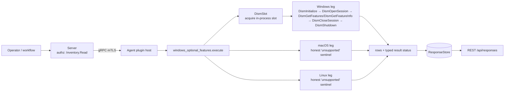

# windows_optional_features

<!-- BEGIN GENERATED: plugin-doc-gen header -->
| | |
|---|---|
| **What it does** | Windows optional OS feature state (enabled/disabled/pending) via the DISM API |
| **Version** | 1.0.0 |
| **Kind** | Collector · read-only · gathered (windows.features.list, windows.features.info) |
| **Platforms** | Windows ✅ · macOS ⛔ unsupported · Linux ⛔ unsupported |
| **Actions** | `info` (definition `windows.features.info`) · `list` (definition `windows.features.list`) |
| **Security** | securable `Inventory` · operation Read · risk Low · dispatch ReadOnly · approval gate None |
| **Roles** | execute: endpoint-admin, endpoint-operator · author: content-author |
<!-- END GENERATED -->

## How it works

Both actions run the same DISM session lifecycle, in order, entirely inside one bounded call on a worker thread: acquire the plugin's own in-process slot (`DismSlot`, at most one DISM call in flight at a time) → `DismInitialize` → `DismOpenSession(DISM_ONLINE_IMAGE)` → `DismGetFeatures` (`list`) or `DismGetFeatureInfo` (`info`) → map each `DismPackageFeatureState`/`DismRestartType` int to a named state → `DismCloseSession` → `DismShutdown` → release the slot. `DismApi.dll` is never linked; its eight exports are resolved once at runtime from `System32` (see the source header comment for why). The dispatching thread only ever tries to acquire the slot and waits on the bounded call — the DISM calls themselves always run on the worker.

**What it is NOT.** No enable, disable, add, remove or commit — the eight resolved exports are the plugin's whole DISM surface, and none of them mutates. No `dism.exe` subprocess: everything is an in-process API call. No WMI: `Win32_OptionalFeature` is not used.



## OS capability

<!-- BEGIN GENERATED: plugin-doc-gen capability -->
| Action | Windows | macOS | Linux |
|---|---|---|---|
| `info` | ✅ supported · rung 1 · DISM API DismOpenSession(DISM_ONLINE_IMAGE) + DismGetFeatures/DismGetFeatureInfo | ⛔ unsupported | ⛔ unsupported |
| `list` | ✅ supported · rung 1 · DISM API DismOpenSession(DISM_ONLINE_IMAGE) + DismGetFeatures/DismGetFeatureInfo | ⛔ unsupported | ⛔ unsupported |

**Declared limits per leg** (descriptor fallback text, verbatim):

- **`info` / Windows** — verified live on the-rig under NT AUTHORITY\\SYSTEM, 2026-09-08
- **`info` / macOS** — Windows-only: DISM has no Linux/macOS equivalent
- **`info` / Linux** — Windows-only: DISM has no Linux/macOS equivalent
- **`list` / Windows** — verified live on the-rig under NT AUTHORITY\\SYSTEM, 2026-09-08
- **`list` / macOS** — Windows-only: DISM has no Linux/macOS equivalent
- **`list` / Linux** — Windows-only: DISM has no Linux/macOS equivalent
<!-- END GENERATED -->

## Privileges and prerequisites

| OS | Runs as | Extra grant needed | Measured | If the read is refused |
|---|---|---|---|---|
| Windows | agent service account (LocalSystem today, #1442) | **Elevated token.** The DISM API refuses an unprivileged caller (`E_ACCESSDENIED`); LocalSystem already satisfies it, so no new grant is needed under the current deployment model. | 2026-09-08, bare-metal, `NT AUTHORITY\SYSTEM` (the-rig, S4U scheduled task) | rows report `feature\|unavailable\|windows:dism:access_denied` / `feature_info\|unavailable\|windows:dism:access_denied`; result status `PERMISSION_DENIED` |
| macOS | agent daemon, unprivileged | n/a — action returns the honest-unsupported sentinel unconditionally | not applicable (Windows-only plugin) | n/a — no DISM call is attempted |
| Linux | agent daemon, unprivileged | n/a — action returns the honest-unsupported sentinel unconditionally | not applicable (Windows-only plugin) | n/a — no DISM call is attempted |

No subprocesses and no network access. `DismApi.dll` is resolved once at process startup via `LoadLibraryExW(..., LOAD_LIBRARY_SEARCH_SYSTEM32)` + `GetProcAddress` against eight exports, never `DismApi.lib`/`#include <dismapi.h>` — no Windows ADK dependency (see `tests/unit/fixtures/wave9/probes/the-rig-dism-findings.md`).

## Data contract

### Inputs

<!-- BEGIN GENERATED: plugin-doc-gen inputs -->
| Definition | Parameter | Type | Required | Default | Constraints | Description |
|---|---|---|---|---|---|---|
| `windows.features.info` | `feature` | string | yes | - | pattern: ^[A-Za-z0-9._-]{1,256}$ | The DISM feature name (FeatureName), e.g. NetFx3. |
| `windows.features.list` | `state` | string | no | - | enum: enabled, disabled, pending | Optional filter narrowing the result to one state bucket. |
<!-- END GENERATED -->

### Outputs

Pipe-delimited rows via `write_output()`. `list` writes one `feature|` row per feature (or per matching feature when `state` filters); `info` writes exactly one `feature_info|` row. On an unsupported or unavailable leg, both actions instead write a single sentinel row: `feature|unsupported|<os>:dism:unsupported` / `feature|unavailable|windows:dism:<token>` (or the `feature_info` equivalent for `info`) — never a blank or omitted row.

<!-- BEGIN GENERATED: plugin-doc-gen outputs -->
**`windows.features.info` — `name|display_name|state|restart_type|description`**

| Field | Type | Values | Available | Example | Description |
|---|---|---|---|---|---|
| `name` | string | - | Windows | `NetFx3` | DISM feature name (FeatureName), e.g. NetFx3. |
| `display_name` | string | - | Windows | `.NET Framework 3.5 (includes .NET 2.0 and 3.0)` | Operator-visible feature display name (DismFeatureInfo.DisplayName). |
| `state` | string | - | Windows | `enabled` | Feature state. Values: enabled, disabled, pending_enable, pending_disable, superseded, partially_installed, unknown. |
| `restart_type` | string | - | Windows | `possible` | Restart requirement for a pending change (DismFeatureInfo.RestartRequired). Values: no, possible, required, unknown. |
| `description` | string | - | Windows | `.NET Framework 3.5 (includes .NET 2.0 and 3.0)` | Feature description (DismFeatureInfo.Description). |

**`windows.features.list` — `name|state|restart_required`**

| Field | Type | Values | Available | Example | Description |
|---|---|---|---|---|---|
| `name` | string | - | Windows | `NetFx3` | DISM feature name (FeatureName), e.g. NetFx3. |
| `state` | string | - | Windows | `enabled` | Feature state. Values: enabled, disabled, pending_enable, pending_disable, superseded, partially_installed, unknown. |
| `restart_required` | boolean | - | Windows | `0` | Whether a restart is needed to complete a pending enable/disable. Values: 1 (pending state), 0 (not pending) — a digit, never true/false. |
<!-- END GENERATED -->

### Result status

| Status | Completeness | Provenance | When |
|---|---|---|---|
| `UNDECLARED` (agent-derived `OK`) | — | — | a clean `list`/`info` read — the DISM call succeeded and the feature row(s) were written |
| `UNAVAILABLE` | PARTIAL | `windows:dism:api_unavailable` | `DismApi.dll` or one of its eight required exports could not be resolved from `System32` |
| `UNAVAILABLE` | PARTIAL | `linux:dism:unsupported`, `macos:dism:unsupported` | Linux/macOS: DISM has no equivalent on this platform |
| `UNAVAILABLE` | FULL | `windows:dism:feature_not_found` | `info`: the named feature does not exist (`DismGetFeatureInfo` returns `DISMAPI_E_UNKNOWN_FEATURE`) |
| `CONSTRAINED` | PARTIAL | `windows:dism:busy` | another DISM call already holds the plugin's in-process slot, or the bounded-call outstanding-call ceiling rejected this call before it started |
| `CONSTRAINED` | PARTIAL | `windows:dism:abandoned` | a previous call timed out and its worker has not returned; the DISM API is still held by that worker until it does |
| `CONSTRAINED` | PARTIAL | `windows:dism:timeout` | `DismGetFeatures`/`DismGetFeatureInfo` did not return within the 17s bounded timeout |
| `CONSTRAINED` | PARTIAL | `windows:dism:initialize_failed`, `windows:dism:open_session_failed`, `windows:dism:get_features_failed`, `windows:dism:get_feature_info_failed` | a DISM session-lifecycle call failed with a non-access-denied HRESULT |
| `CONSTRAINED` | PARTIAL | `windows:dism:exception` | an unhandled exception was caught inside the bounded DISM call |
| `PERMISSION_DENIED` | PARTIAL | `windows:dism:access_denied` | a DISM call in the session returned `E_ACCESSDENIED` — the caller's token lacks the elevated privilege the DISM API requires |

### Where the data goes

- **Instruction result only.** Rows travel over the agent's mTLS gRPC channel as the command response and land in the ResponseStore (`response_retention_days`, default 90 days), queryable at `/api/responses/{id}` and aggregatable (`list` groups by `state`, counted).
- **Not consumed by** daily-sync inventory, the TAR warehouse, DEX, or metrics. `gather.ttlSeconds: 300` only caps how often a repeat dispatch is served from cache; nothing runs on a schedule.
- **Sensitivity.** Rows name which built-in Windows OS features are enabled on the device (e.g. `SMB1Protocol`, `TelnetClient`) — a security-relevant configuration signal, but no username, hostname, serial number or file path appears in any field.
- **Siblings:** `msi_packages` (installed third-party/MSI software, not OS features), `windows_updates` (patch history, not feature toggles), `registry`/`wmi` (general-purpose Windows reads this plugin's narrow DISM surface deliberately does not replace) — none join with this plugin's output.
- **MCP / REST.** Discover: `discover_plugins` (summary) → `yuzu://plugin-docs` (this page as data) → `discover_instructions` / `get_definition("windows.features.list")`. Run: `execute_instruction {definition_id, parameters}`. Read: `/api/responses/{id}`.

## Sample output

<!-- BEGIN GENERATED: plugin-doc-gen samples -->
**Windows** — captured: windows Windows 10.0.26200 x86_64 · bare-metal · 2026-09-08 · LocalSystem (elevated) · leg-hash f85a83ef6582

```
== action=list
feature|Printing-XPSServices-Features|enabled|0
feature|TelnetClient|disabled|0
feature|TFTP|disabled|0
feature|TIFFIFilter|disabled|0
feature|VirtualMachinePlatform|enabled|0
feature|Client-ProjFS|disabled|0
feature|SimpleTCP|disabled|0
feature|WorkFolders-Client|enabled|0
feature|NetFx3|enabled|0
feature|WCF-HTTP-Activation|disabled|0
feature|WCF-NonHTTP-Activation|disabled|0
feature|IIS-WebServerRole|disabled|0
… 12 of 137 rows shown
[result_status] UNDECLARED / UNKNOWN

== action=info feature=NetFx3
feature_info|NetFx3|.NET Framework 3.5 (includes .NET 2.0 and 3.0)|enabled|possible|.NET Framework 3.5 (includes .NET 2.0 and 3.0)
[result_status] UNDECLARED / UNKNOWN
```
<!-- END GENERATED -->

## Caveats and known gaps

1. **DISM is process-global and single-session.** The Windows DISM API does not support concurrent sessions safely from the same process; this plugin serialises every `list`/`info` call through its own in-process `DismSlot` (at most one DISM call in flight), reporting `windows:dism:busy` to a second caller rather than risking undefined concurrent-session behaviour.
2. **A timed-out call is `abandoned`, not cleared, until the worker returns.** If `DismGetFeatures`/`DismGetFeatureInfo` exceeds the 17s bounded timeout, the dispatching thread reports `windows:dism:timeout` and marks the slot abandoned; every subsequent call reports `windows:dism:abandoned` until the original worker thread actually finishes and releases the slot — permanently, if DISM itself never returns, cleared only by a service restart.
3. **Pending states come from the feature enum, not a reboot-pending registry key.** `pending_enable`/`pending_disable` reflect `DismPackageFeatureState`'s `InstallPending`/`UninstallPending` values as reported by DISM itself, not an independent reboot-pending check.
4. **Feature names are DISM's internal names, not Control Panel labels.** `NetFx3`, `SMB1Protocol`, `TelnetClient` etc. are the `FeatureName` DISM uses internally; the `info` action's `display_name` field carries the operator-visible label.
5. **The macOS/Linux rows are placeholders by design.** DISM has no equivalent on either platform — both legs return the honest `unsupported` row unconditionally, never an empty read or a fabricated value.

## Source and tests

<!-- BEGIN GENERATED: plugin-doc-gen source -->
- Plugin: `agents/plugins/windows_optional_features/src/windows_optional_features_parsers.hpp` · `agents/plugins/windows_optional_features/src/windows_optional_features_plugin.cpp`
- Definitions: `content/definitions/windows_optional_features.yaml`
- Capability rows: `server/core/src/capability_decls/plugin_action_catalogue_windows_optional_features.hpp`
- Tests: `tests/unit/test_windows_optional_features_local_dispatcher.cpp` · `tests/unit/test_windows_optional_features_parsers.cpp`
- Privilege row: `docs/agent-privilege-model.md`
<!-- END GENERATED -->
