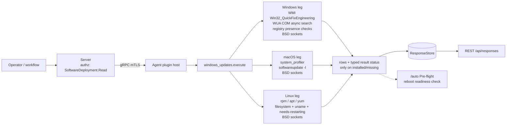

# windows_updates

<!-- BEGIN GENERATED: plugin-doc-gen header -->
| | |
|---|---|
| **What it does** | Updates/packages: installed, available, pending-reboot, patch connectivity |
| **Version** | 1.1.0 · plugin ABI 4 · last changed in PR #3379 (2026-08-23) |
| **Kind** | Collector · read-only · on-demand (gather-cached, ttl 300-600s) |
| **Platforms** | Windows ✅ · macOS 🟡 constrained · Linux ✅ |
| **Actions** | `installed` (definition `device.windows_updates.installed`) · `missing` (`device.windows_updates.missing`) · `pending_reboot` (`device.windows_updates.pending_reboot`) · `patch_connectivity` (`device.windows_updates.patch_connectivity`) |
| **Security** | securable `SoftwareDeployment` · operation Read · risk Low · dispatch ReadOnly · approval gate none |
| **Roles** | execute: endpoint-admin, endpoint-operator · author: content-author |
<!-- END GENERATED -->

## How it works

`installed` and `missing` each read update state through a different mechanism per OS and emit
whatever shape that mechanism naturally returns — there is no shared cross-platform schema. `installed`
runs first: a bounded WMI query on Windows, `rpm --last` falling back to `apt list --installed` on
Linux, `system_profiler SPInstallHistoryDataType` on macOS. `missing` mirrors that fan-out with a
different mechanism per OS (WUA COM search, `apt`/`yum`, `softwareupdate -l`). On Windows this is not a
single blocking call: `do_missing` calls `IUpdateSearcher::BeginSearch` (async) then polls
`ISearchJob::get_IsCompleted` every 500ms until it returns true or a 120s deadline elapses
(`windows_updates_plugin.cpp:381-398`) — the real WUA search against the Windows Update service is what
makes this action's measured runtime (~12s in the capture below) far longer than every other action
here, all of which are local reads. `pending_reboot` is
independent of both — three-to-four per-OS existence/comparison checks, each written as its own row,
folded into one trailing `reboot_required` summary row. `patch_connectivity` is the odd one out: a pure
network probe (DNS + TCP, no update-manager call at all) against either the caller's `targets` parameter
or a built-in per-OS default list, so it is the plugin's only action that takes parameters and the only
one whose mechanism is identical on every OS.

This plugin is deliberately never a mutator: it has no install/patch-apply action anywhere in it (that
lives in other plugins, e.g. `sccm`, `software_actions`). It is also deliberately not an exhaustive
history: `installed` is bounded (512 rows on Windows, 50 lines on Linux, 100 matched lines on macOS),
never a full historical log.



## OS capability

<!-- BEGIN GENERATED: plugin-doc-gen capability -->
| Action | Windows | macOS | Linux |
|---|---|---|---|
| `installed` | ✅ supported · rung 1 · `wmi_bounded_query` | ✅ supported · rung 2 · `system_profiler` | ✅ supported · rung 2 · `rpm+apt` |
| `missing` | ✅ supported · rung 1 · `wua_com_async_search` | ✅ supported · rung 2 · `softwareupdate` | ✅ supported · rung 2 · `apt+yum` |
| `pending_reboot` | ✅ supported · rung 1 · `registry` | 🟡 constrained · rung 2 · `softwareupdate` | ✅ supported · rung 3 · `filesystem+uname+vmlinuz_ls+needs_restarting` |
| `patch_connectivity` | ✅ supported · rung 1 · `raw_sockets` | ✅ supported · rung 1 · `raw_sockets` | ✅ supported · rung 1 · `raw_sockets` |

**Declared limits per leg** (the descriptor's fallback text, verbatim):

- **`pending_reboot` / macOS** — bounded (60s deadline) since this migration, but still a slow network call -- no longer able to hang indefinitely on an offline/headless Mac.
<!-- END GENERATED -->

## Privileges and prerequisites

| OS | Runs as | Extra grant needed | Measured | If the read is refused |
|---|---|---|---|---|
| Windows | agent service account (LocalSystem today, #1442) | None documented in this plugin's code: the WMI query and WUA COM search are daemon-mediated broker calls, and the three registry reads are presence-only `RegOpenKeyExA(..., KEY_READ)` calls against HKLM. | 2026-09-07, bare-metal, `SYSTEM` | `installed`/`missing`: `WMI query failed: ...` / `Failed to ... (0x...)` rows plus `UNAVAILABLE`/`CONSTRAINED`; `pending_reboot`: the affected check's row reads `false` (key not found reads the same as key inaccessible — no distinct refusal shape) |
| macOS | agent daemon, unprivileged | None measured: `system_profiler`, `softwareupdate -l`, and the DNS/TCP probes all returned real data unprivileged. | 2026-09-07, euid 501 (`alex`) | tool spawn/timeout is forwarded via `forward_runner_failure`; a fully-filtered `softwareupdate -l` output returns zero `missing` rows with no explicit refusal marker (see Caveats) |
| Linux | agent daemon (`_yuzu`/`yuzu` per `docs/agent-privilege-model.md`'s general convention — no dedicated row exists for this plugin) | None measured: `rpm`/`apt`/`yum` and the filesystem/kernel checks all ran successfully. Sample was captured as `euid 0` in a container, so this is not evidence the agent's usual non-root identity is sufficient — only that the code makes no explicit privilege check. | 2026-09-06, container, `euid 0` | a spawn/timeout failure is forwarded via `forward_runner_failure`; a clean "nothing to report" exit (e.g. `apt` finding no upgrades) is not distinguishable from a refusal in the row data alone |

No row exists in `docs/agent-privilege-model.md` for `windows_updates`.

Binaries/subprocesses: Linux — `/usr/bin/rpm`, `/usr/bin/apt`, `/usr/bin/yum` (argv, ADR-3002 rung 2)
plus `uname -r` / `ls -t /boot/vmlinuz-*` / `needs-restarting -r` (rung 3 shell strings via `popen`,
grandfathered, tracked #2380). macOS — `/usr/sbin/system_profiler`, `/usr/sbin/softwareupdate` (argv).
Windows — none (in-process WMI/WUA COM/registry). Network: `patch_connectivity`'s DNS resolution + TCP
connect on every OS; `missing`'s Windows WUA search and macOS `softwareupdate -l` call also reach a
vendor update service.

## Data contract

### Inputs

<!-- BEGIN GENERATED: plugin-doc-gen inputs -->
| Action | Parameter | Type | Required | Default | Description |
|---|---|---|---|---|---|
| `installed` | — | — | — | — | takes no parameters |
| `missing` | — | — | — | — | takes no parameters |
| `pending_reboot` | — | — | — | — | takes no parameters |
| `patch_connectivity` | `targets` | string | no | — | Comma-separated list of URLs to test connectivity against. Empty uses the platform's default patch servers. |
| `patch_connectivity` | `timeout_seconds` | int32 | no | `10` | TCP connection timeout per target, in seconds (validated 1-60; the plugin also independently clamps to that range). |
<!-- END GENERATED -->

`patch_connectivity`'s definition (`device.windows_updates.patch_connectivity`) is declared in
`content/definitions/t2_capabilities.yaml`, not in this plugin's own `windows_updates.yaml` — see
Siblings below.

### Outputs

Pipe-delimited rows, one `write_output()` call per line. `installed` and `missing` are **not** a single
stable schema: the field count and the meaning of each field vary by OS, and on Linux by which tool ran
(`rpm` vs its `apt` fallback for `installed`; `apt` vs its `yum` fallback for `missing`). `pending_reboot`
is a stable 3-field `source|pending|detail` shape for every row including the summary. `patch_connectivity`
multiplexes three distinct row shapes (DNS, TCP, summary) as `tag|value` pairs after a shared
`target|<url>|` (or `summary|`) prefix — an unpopulated field is simply absent from that row, never a `-`
placeholder.

<!-- BEGIN GENERATED: plugin-doc-gen outputs -->
**`installed` — `update|kb_id|description|date` (Windows) · `package|name|date_or_version` (Linux) · `update|name|date` (macOS)**

| Field | Type | Values | Available | Example |
|---|---|---|---|---|
| `identifier` | string | free text | W, L, M | `KB5122385` |
| `description` | string | free text or empty | W only | `Update` |
| `install_date` | string | date string, or a package version on Linux/apt | W, L, M | `9/1/2026` |

**`missing` — `available|title|severity` (Windows) · `available|name|version` (Linux/apt) · `available|<line>` (Linux/yum, macOS)**

| Field | Type | Values | Available | Example |
|---|---|---|---|---|
| `title` | string | free text | W, L, M | `Security Intelligence Update for Microsoft Defender Antivirus - KB2267602 (Version 1.459.91.0) - Current Channel (Broad)` |
| `severity` | string | free text or empty | W only | (empty) |

**`pending_reboot` — `source|pending|detail`**

| Field | Type | Values | Available | Example |
|---|---|---|---|---|
| `source` | enum | `windows_update_reboot` `cbs_reboot` `pending_file_rename` `reboot_required_file` `kernel_mismatch` `needs_restarting` `softwareupdate_restart` `reboot_required` | W, L, M (each OS emits only its own subset) | `pending_file_rename` |
| `pending` | bool | `true` `false` | W, L, M | `true` |
| `detail` | string | free text or empty | W, L, M | `Non-empty value` |

**`patch_connectivity` — `target\|<url>\|dns_ok\|bool\|dns_ms\|N\|ip\|addr` · `target\|<url>\|tcp_ok\|bool\|tcp_ms\|N[\|tcp_error\|msg]` · `summary\|targets_tested\|N\|targets_reachable\|N\|targets_failed\|N`**

| Field | Type | Values | Available | Example |
|---|---|---|---|---|
| `target` | string | the tested URL | W, L, M | `https://windowsupdate.microsoft.com` |
| `dns_ok` | bool | `true` `false` | W, L, M | `true` |
| `dns_ms` | int32 | milliseconds | W, L, M | `3` |
| `ip` | string | resolved IP, or the DNS error text when `dns_ok=false` | W, L, M | `128.85.102.70` |
| `tcp_ok` | bool | `true` `false` | W, L, M | `true` |
| `tcp_ms` | int32 | milliseconds | W, L, M | `160` |
| `tcp_error` | string | free text; row omits this pair entirely when the connect succeeded | W, L, M | `connection refused` |
| `targets_tested` | int32 | count | W, L, M | `3` |
| `targets_reachable` | int32 | count | W, L, M | `3` |
| `targets_failed` | int32 | count | W, L, M | `0` |
<!-- END GENERATED -->

### Result status

| Status | Completeness | Provenance | When |
|---|---|---|---|
| `UNAVAILABLE` / `CONSTRAINED` | PARTIAL | `wmi_bounded:<token>` | `installed`/Windows — the WMI connection or query itself failed |
| `OK` | PARTIAL | `wmi_bounded:row_cap_truncated` | `installed`/Windows — the 512-row cap was hit |
| `OK` | PARTIAL | (forwarded runner outcome, e.g. `subprocess_runner:line_limit`) | `installed`/Linux — `rpm`/`apt` output hit the 50-line cap |
| `UNAVAILABLE` / `CONSTRAINED` | PARTIAL | `windows_updates:<stage>_failed` / `com_init_failed` / `search_deadline_exceeded` / `search_result_failed` | `missing`/Windows — a WUA COM stage failed, or the 120s search deadline was exceeded |
| `OK` | PARTIAL | `windows_updates:search_result_partial` | `missing`/Windows — the search partially succeeded (`orcSucceededWithErrors` or a per-item read failure) |
| (forwarded runner outcome, or none) | — | — | `missing`/Linux, `missing`/macOS, `installed`/macOS — `forward_runner_failure` only reports a status for a genuine spawn/deadline/truncation degradation; a clean tool exit leaves the status `UNDECLARED` |
| — | — | — | `pending_reboot` (all OSes) and `patch_connectivity` (all OSes) never call `set_result_status`; the agent records `UNDECLARED` and every sample shows `UNDECLARED / UNKNOWN /` for these two actions |

### Where the data goes

- **Instruction result only.** Rows travel over the agent's mTLS gRPC channel as the command response
  and land in the ResponseStore, queryable at `/api/responses/{id}`. The dashboard renders every action
  of this plugin generically as Agent/Key/Value rows (`result_parsing.hpp`'s `kKeyValuePlugins`), not a
  plugin-specific table.
- **`pending_reboot` also feeds `/auto` Pre-flight.** `preflight_parse.hpp` parses its trailing
  `reboot_required|<bool>|<reasons>` row as an unconditional summary for the "reboot" readiness check.
- **Not consumed by** the daily-sync inventory framework (ADR-0016), TAR, DEX, or metrics.
- **Siblings:** `content/definitions/t2_capabilities.yaml` (`device.windows_updates.patch_connectivity`,
  the definition that actually declares this action's parameters and result columns) and
  `content/definitions/t2_chaining_examples.yaml` (`workflow.patch_connectivity_audit`, a two-step
  compliance workflow chaining `patch_connectivity` into a log upload). `sccm` and `software_actions`
  cover the mutating side (deploying/applying updates) this plugin deliberately does not.
- **MCP / REST.** Discover: `discover_plugins` (summary) → `yuzu://plugin-docs` (this page as data) →
  `discover_instructions` / `get_definition("device.windows_updates.installed")`. Run:
  `execute_instruction {definition_id, parameters}`. Read: `/api/responses/{id}`, plus the `/auto`
  Pre-flight page for `pending_reboot`.

## Sample output

<!-- BEGIN GENERATED: plugin-doc-gen samples -->
**Windows** — captured: windows Microsoft Windows NT 10.0.26200.0 x64 · bare-metal · 2026-09-07 · SYSTEM · leg-hash pending

```
== action=installed
update|KB5122385|Update|9/1/2026
update|KB5054156|Update|2/16/2026
update|KB5120998|Update|9/1/2026
update|KB5120997|Update|8/31/2026
[result_status] UNDECLARED / UNKNOWN /

== action=missing
available|Security Intelligence Update for Microsoft Defender Antivirus - KB2267602 (Version 1.459.91.0) - Current Channel (Broad)|
[result_status] UNDECLARED / UNKNOWN /

== action=pending_reboot
windows_update_reboot|false|
cbs_reboot|false|
pending_file_rename|true|Non-empty value
reboot_required|true|pending_file_rename
[result_status] UNDECLARED / UNKNOWN /

== action=patch_connectivity
target|https://windowsupdate.microsoft.com|dns_ok|true|dns_ms|3|ip|128.85.102.70
target|https://windowsupdate.microsoft.com|tcp_ok|true|tcp_ms|160
target|https://update.microsoft.com|dns_ok|true|dns_ms|0|ip|128.85.102.70
target|https://update.microsoft.com|tcp_ok|true|tcp_ms|170
target|https://download.windowsupdate.com|dns_ok|true|dns_ms|7|ip|199.232.54.172
target|https://download.windowsupdate.com|tcp_ok|true|tcp_ms|14
summary|targets_tested|3|targets_reachable|3|targets_failed|0
[result_status] UNDECLARED / UNKNOWN /
```

**macOS** — captured: macos macOS 26.6.2 arm64 · bare-metal · 2026-09-07 · euid 501 (alex) · leg-hash pending

```
== action=installed
update|macOS 26.5.1|18/07/2026, 01:41
update|MAContent10_AssetPack_0048_AlchemyPadsDigitalHolyGhost|18/07/2026, 01:44
update|MAContent10_AssetPack_0310_UB_DrumMachineDesignerGB|18/07/2026, 01:44
update|MAContent10_AssetPack_0312_UB_UltrabeatKitsGBLogic|18/07/2026, 01:44
update|MAContent10_AssetPack_0314_AppleLoopsHipHop1|18/07/2026, 01:44
update|MAContent10_AssetPack_0315_AppleLoopsElectroHouse1|18/07/2026, 01:44
update|MAContent10_AssetPack_0316_AppleLoopsDubstep1|18/07/2026, 01:44
update|MAContent10_AssetPack_0317_AppleLoopsModernRnB1|18/07/2026, 01:44
update|MAContent10_AssetPack_0320_AppleLoopsChillwave1|18/07/2026, 01:44
update|MAContent10_AssetPack_0321_AppleLoopsIndieDisco|18/07/2026, 01:44
update|MAContent10_AssetPack_0322_AppleLoopsDiscoFunk1|18/07/2026, 01:44
update|MAContent10_AssetPack_0323_AppleLoopsVintageBreaks|18/07/2026, 01:44
update|MAContent10_AssetPack_0324_AppleLoopsBluesGarage|18/07/2026, 01:44
update|MAContent10_AssetPack_0325_AppleLoopsGarageBand1|18/07/2026, 01:44
update|MAContent10_AssetPack_0354_EXS_PianoSteinway|18/07/2026, 01:44
update|MAContent10_AssetPack_0357_EXS_BassAcousticUprightJazz|18/07/2026, 01:44
update|MAContent10_AssetPack_0358_EXS_BassElectricFingerStyle|18/07/2026, 01:44
update|MAContent10_AssetPack_0371_EXS_GuitarsAcoustic|18/07/2026, 01:44
update|MAContent10_AssetPack_0375_EXS_GuitarsVintageStrat|18/07/2026, 01:44
update|MAContent10_AssetPack_0482_EXS_OrchWoodwindAltoSax|18/07/2026, 01:44
update|MAContent10_AssetPack_0484_EXS_OrchWoodwindClarinetSolo|18/07/2026, 01:44
update|MAContent10_AssetPack_0487_EXS_OrchWoodwindFluteSolo|18/07/2026, 01:44
update|MAContent10_AssetPack_0491_EXS_OrchBrass|18/07/2026, 01:44
update|MAContent10_AssetPack_0509_EXS_StringsEnsemble|18/07/2026, 01:44
update|MAContent10_AssetPack_0536_DrummerClapsCowbell|18/07/2026, 01:44
… 25 of 50 rows
[result_status] UNDECLARED / UNKNOWN /

== action=missing
[result_status] UNDECLARED / UNKNOWN /

== action=pending_reboot
softwareupdate_restart|false|
reboot_required|false|
[result_status] UNDECLARED / UNKNOWN /

== action=patch_connectivity
target|https://swscan.apple.com|dns_ok|true|dns_ms|12|ip|2.16.176.247
target|https://swscan.apple.com|tcp_ok|true|tcp_ms|22
target|https://swdist.apple.com|dns_ok|true|dns_ms|2|ip|17.253.29.150
target|https://swdist.apple.com|tcp_ok|true|tcp_ms|23
summary|targets_tested|2|targets_reachable|2|targets_failed|0
[result_status] UNDECLARED / UNKNOWN /
```

**Linux** — captured: linux Debian GNU/Linux 13 (trixie) aarch64 · container · 2026-09-06 · euid 0 · leg-hash pending

```
== action=installed
package|apt|3.0.3
package|autoconf|2.72-3.1
package|automake|1:1.17-4
package|autotools-dev|20240727.1
package|base-files|13.8+deb13u6
package|base-passwd|3.6.7
package|bash|5.2.37-2+b9
package|binutils-aarch64-linux-gnu|2.44-3
package|binutils-common|2.44-3
package|binutils|2.44-3
package|bison|2:3.8.2+dfsg-1+b2
package|bsdutils|1:2.41.5-0+deb13u1
package|ca-certificates|20250419
package|cmake-data|3.31.6-2
package|cmake|3.31.6-2
package|coreutils|9.7-3
package|cpp-13-aarch64-linux-gnu|13.3.0-16
package|cpp-13|13.3.0-16
package|cpp-14-aarch64-linux-gnu|14.2.0-19
package|cpp-14|14.2.0-19
package|cpp-aarch64-linux-gnu|4:14.2.0-1
package|cpp|4:14.2.0-1
package|curl|8.14.1-2+deb13u4
package|dash|0.5.12-12
package|debconf|1.5.91
… 25 of 49 rows
[result_status] OK / PARTIAL / subprocess_runner:line_limit

== action=missing
available|none|System is up to date
[result_status] UNDECLARED / UNKNOWN /

== action=pending_reboot
reboot_required_file|false|
needs_restarting|false|
reboot_required|false|
[result_status] UNDECLARED / UNKNOWN /

== action=patch_connectivity
target|https://archive.ubuntu.com|dns_ok|true|dns_ms|37|ip|185.125.190.83
target|https://archive.ubuntu.com|tcp_ok|true|tcp_ms|14
target|https://security.ubuntu.com|dns_ok|true|dns_ms|12|ip|185.125.190.82
target|https://security.ubuntu.com|tcp_ok|true|tcp_ms|19
summary|targets_tested|2|targets_reachable|2|targets_failed|0
[result_status] UNDECLARED / UNKNOWN /
```
<!-- END GENERATED -->

## Caveats and known gaps

1. **macOS `missing` can return zero rows with no placeholder.** `do_missing`'s macOS branch only
   writes an `available|none|...` placeholder when `softwareupdate -l`'s raw output is empty
   (`windows_updates_plugin.cpp:569-575`); when the raw output is non-empty but entirely banner/status
   text, `parse_softwareupdate_list` filters every line out (`windows_updates_parsers.hpp:228-243`,
   drops `"Software Update"`/`"Finding"`/`"No new"` lines) and nothing is written at all — exactly what
   the macOS sample above shows for `missing`. A consumer cannot distinguish "no updates" from "the tool
   produced nothing recognisable" for this action on macOS.
2. **`installed`/`missing` have no single field schema.** The `identifier|description|install_date` and
   `title|severity` shapes declared in the definition YAML fit the Windows leg; on Linux and macOS both
   actions emit two data fields, not three (`installed`) or the raw tool line (`missing`/yum and
   macOS), and on Linux `installed`'s third field is a package version, not a date, whenever the `apt`
   fallback ran instead of `rpm` (`windows_updates_plugin.cpp:252-272`).
3. **`installed`'s row order and cap changed with the WMI migration.** The retired PowerShell path
   returned the 50 most-recently-installed hotfixes, newest first; the WMI-sourced path returns up to
   512 rows in whatever order the provider yields (WQL has no `ORDER BY` for a data-class query) —
   disclosed in `windows_updates_plugin.cpp:200-207` and the `wave3-pr33d` changelog entry, not a defect.
4. **The `raw_sockets` mechanism name is ordinary TCP, not `SOCK_RAW`.** `test_dns`/`test_tcp`
   (`windows_updates_plugin.cpp:788-881`) use `getaddrinfo` + a plain `SOCK_STREAM` `connect()`; the
   descriptor's mechanism string is a convention shared across plugins for "direct BSD/Winsock sockets",
   not a literal raw-socket claim.
5. **`missing`'s Windows leg is unverified on real Windows.** The header comment above `do_missing`'s
   WUA branch (`windows_updates_plugin.cpp:309-320`) states it "could not be verified on this
   (non-Windows) host" and was written from the documented COM API surface; `test_windows_updates_win_actions.cpp`
   deliberately exercises only `installed`, not `missing`, to avoid a network-dependent unit test.

## Source and tests

<!-- BEGIN GENERATED: plugin-doc-gen source -->
- Plugin: `agents/plugins/windows_updates/src/windows_updates_plugin.cpp` (descriptor legs, all four actions) · `windows_updates_parsers.hpp` (pure parse/format helpers, OS-free)
- Definitions: `content/definitions/windows_updates.yaml` (`installed`, `missing`, `pending_reboot`) · `content/definitions/t2_capabilities.yaml` (`patch_connectivity`) · `content/definitions/t2_chaining_examples.yaml` (sibling workflow, not a definition of this plugin)
- Capability rows: `server/core/src/capability_decls/plugin_action_catalogue_d.hpp`
- Tests: `tests/unit/test_windows_updates_parsers.cpp` (38 cases, pure parsers, every OS) · `tests/unit/test_windows_updates_posix_actions.cpp` (`installed` via the real Linux/macOS plugin + `LocalDispatcher`) · `tests/unit/test_windows_updates_win_actions.cpp` (`installed` via the real Windows plugin + `LocalDispatcher`)
- Privilege row: no row in `docs/agent-privilege-model.md`
- Changelog: `changelog.d/2204-declarations-group-d.added.md` · `changelog.d/wave3-pr33d-windows-updates-sccm-native.changed.md`
<!-- END GENERATED -->
