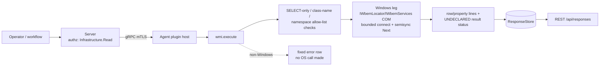

# wmi

<!-- BEGIN GENERATED: plugin-doc-gen header -->
| | |
|---|---|
| **What it does** | Windows Management Instrumentation — WQL queries and instance enumeration |
| **Version** | 1.1.0 |
| **Kind** | Action · read-only · on-demand (no scheduled gather) |
| **Platforms** | Windows ✅ · macOS ⛔ · Linux ⛔ |
| **Actions** | `query` (definition `windows.wmi.query`) · `get_instance` (definition `windows.wmi.get_instance`) |
| **Security** | securable `Infrastructure` · operation Read · risk Medium · dispatch ReadOnly · approval gate none |
| **Roles** | execute: endpoint-admin, endpoint-operator · author: content-author |
<!-- END GENERATED -->

## How it works

`query` runs an operator-supplied WQL statement and `get_instance` builds `SELECT * FROM <class>` from a class name — both funnel through the same shared helper, `yuzu::shared::wmi::run_bounded_wmi_query` (`agents/shared/wmi_bounded.hpp:224`). Before either reaches WMI, the plugin validates its own inputs: `query` requires the statement to start with `SELECT` (`wmi_plugin.cpp:38-49`, `is_select_only`) and `get_instance` requires the class name to be alphanumeric/underscore only (`wmi_plugin.cpp:52-59`, `is_valid_wmi_class`); both then check the target namespace against a fixed allow-list of `root\cimv2`, `root\wmi`, `root\standardcimv2` (`wmi_plugin.cpp:62-80`, `is_valid_wmi_namespace`). Only after both checks pass does the helper connect (`WBEM_FLAG_CONNECT_USE_MAX_WAIT`) and enumerate results with a per-call timeout and a whole-enumeration deadline — never `Next(WBEM_INFINITE, ...)` (`wmi_bounded.hpp:8-13, 220-223`). `get_instance` additionally caps the helper to one row and a 5s deadline (`wmi_plugin.cpp:192-195`), so it always returns at most the first matching instance, never an enumeration of every instance of the class.

The plugin deliberately does not expose WMI method invocation: `wmi_bounded.hpp` ships an `exec_object_method` helper with no production caller and an explicit warning that its caller must add its own namespace/method allow-listing before wiring it up (`wmi_bounded.hpp:312-320`) — `wmi_plugin.cpp` never calls it. It is also deliberately Windows-only: `execute()` returns a fixed error string on every other OS without touching any OS API (`wmi_plugin.cpp:126-128`).



## OS capability

<!-- BEGIN GENERATED: plugin-doc-gen capability -->
| Action | Windows | macOS | Linux |
|---|---|---|---|
| `query` | ✅ supported · rung 1 · `wmi` (IWbemLocator/IWbemServices COM API) | ⛔ unsupported · no mechanism bound | ⛔ unsupported · no mechanism bound |
| `get_instance` | ✅ supported · rung 1 · `wmi` (IWbemLocator/IWbemServices COM API) | ⛔ unsupported · no mechanism bound | ⛔ unsupported · no mechanism bound |

**Declared limits per leg** (the descriptor's fallback text, verbatim):

- None declared — every leg's fallback field is empty (`wmi_plugin.cpp:89-98`); the constraints below come from the plugin's own input validation, not a per-leg descriptor caveat.
<!-- END GENERATED -->

## Privileges and prerequisites

| OS | Runs as | Extra grant needed | Measured | If the read is refused |
|---|---|---|---|---|
| Windows | agent service account (LocalSystem today, #1442 — `docs/agent-privilege-model.md:12`) | Not established by a capture: the only Windows sample was taken as SYSTEM (`docs/samples/windows.txt:1`), which succeeds; no unprivileged Windows capture exists for this plugin. WMI's own DCOM ACL, not an agent-side grant, decides access. | 2026-09-07, bare-metal, `SYSTEM` (`docs/samples/windows.txt:1`) | A denied connect/query surfaces as `error\|<token>` and rc 1, e.g. `wbem_locator_failed` or `wmi_connect_failed_<hr>` (`wmi_bounded.hpp:194-216`, `wmi_plugin.cpp:151-155`) — there is no distinct permission-denied status |
| macOS | n/a — leg not implemented | n/a | 2026-09-07, bare-metal, euid 501 (unprivileged) (`docs/samples/macos.txt:1`) | Always `error\|WMI not available on this platform`, rc 1, regardless of privilege (`wmi_plugin.cpp:126-128`) |
| Linux | n/a — leg not implemented | n/a | 2026-09-06, container, euid 0 (`docs/samples/linux.txt:1`) | Always `error\|WMI not available on this platform`, rc 1, regardless of privilege (`wmi_plugin.cpp:126-128`) |

No external binaries and no subprocesses — the Windows leg talks to the local WMI service (`WinMgmt`) over in-process COM/RPC only (`connect_bounded`, `wmi_bounded.hpp:194-216`); no other network access.

## Data contract

### Inputs

<!-- BEGIN GENERATED: plugin-doc-gen inputs -->
| Action | Parameter | Type | Required | Default | Description |
|---|---|---|---|---|---|
| `query` | `wql` | string | yes | — | A WQL SELECT statement (e.g., "SELECT * FROM Win32_OperatingSystem"); the plugin rejects anything not starting with SELECT |
| `query` | `namespace` | string | no | `root\cimv2` | WMI namespace — must be `root\cimv2`, `root\wmi`, or `root\standardcimv2` |
| `get_instance` | `class` | string | yes | — | WMI class name, alphanumeric and underscores only (e.g., Win32_OperatingSystem) |
| `get_instance` | `namespace` | string | no | `root\cimv2` | WMI namespace — must be `root\cimv2`, `root\wmi`, or `root\standardcimv2` |
<!-- END GENERATED -->

### Outputs

Both actions emit pipe-delimited lines, not the two-column `property`/`value` shape the definition YAML's `result.columns` implies on its own: `query` writes one `row<N>|<property>|<value>` line per returned property (`wmi_plugin.cpp:159-160`) followed by a terminal `rows|<count>` line (`wmi_plugin.cpp:168`) and, if the shared helper's row cap was hit, an `error|row_cap_exceeded` line before it (`wmi_plugin.cpp:163-168`); `get_instance` writes one `property|<name>|<value>` line per property of the single matched instance, with no trailing count line (`wmi_plugin.cpp:201-203`). A property is omitted from either action's output entirely — never emitted with an empty value — when its VARIANT type isn't one `variant_to_string` knows how to stringify, including `VT_NULL`/`VT_EMPTY` (`wmi_bounded.hpp:152-171, 182-184`).

<!-- BEGIN GENERATED: plugin-doc-gen outputs -->
**`query` — `row<N>|property|value`**

| Field | Type | Values | Available | Example |
|---|---|---|---|---|
| `property` | string | WMI property name | W | `Caption` |
| `value` | string | stringified property value | W | `Microsoft Windows 11 Pro` |

**`get_instance` — `property|property|value`**

| Field | Type | Values | Available | Example |
|---|---|---|---|---|
| `property` | string | WMI property name | W | `BootDevice` |
| `value` | string | stringified property value | W | `\Device\HarddiskVolume1` |
<!-- END GENERATED -->

### Result status

This plugin does not set a typed result status (no `set_result_status`/`yuzu_ctx_set_result_status` call anywhere in `wmi_plugin.cpp` — confirmed by grep); the agent records `UNDECLARED` and every sample shows `UNDECLARED / UNKNOWN /` (`docs/samples/windows.txt:5,62`; `docs/samples/macos.txt:4,9`; `docs/samples/linux.txt:4,9`). A validation failure, a query failure, or an unsupported-OS call is distinguishable only by the `error|...` row and the exit code, never by this status field.

### Where the data goes

- **Instruction result only.** Rows travel as the command response and land in the ResponseStore, queryable at `/api/responses/{id}`. Nothing in `server/` references `windows.wmi.query`/`windows.wmi.get_instance` or the `wmi` plugin name outside the capability-catalogue declaration (`server/core/src/capability_decls/plugin_action_catalogue_d.hpp:409-431`) — confirmed by grep across `server/`.
- **Not consumed by** daily-sync inventory, the TAR warehouse, DEX, or metrics. Nothing runs on a schedule; the plugin executes only when an operator or workflow dispatches one of its two definitions (`content/definitions/wmi.yaml`, both `spec.execution.concurrency: per-device` with no `gather`).
- **Siblings:** none declared — `wmi` is the operator-facing ad-hoc query surface; several other plugins (`hardware`, `license_scan`) use `agents/shared/wmi_bounded.hpp` internally for their own fixed queries (`wmi_bounded.hpp:1-21`), and `bitlocker`'s parser reuses the helper's `WmiRow` type alias (`bitlocker_windows_wmi.hpp:17`) — none of them are peers of this plugin's two definitions.
- **MCP / REST.** Discover: `discover_plugins` (summary) → `yuzu://plugin-docs` (this page as data) → `discover_instructions` / `get_definition("windows.wmi.query")`. Run: `execute_instruction {definition_id, parameters}`. Read: `/api/responses/{id}`.

## Sample output

<!-- BEGIN GENERATED: plugin-doc-gen samples -->
**Windows** — captured: windows Microsoft Windows NT 10.0.26200.0 x64 · bare-metal · 2026-09-07 · SYSTEM · leg-hash pending

```
== action=query wql="SELECT Caption FROM Win32_OperatingSystem"
row0|Caption|Microsoft Windows 11 Pro
rows|1
[result_status] UNDECLARED / UNKNOWN / 

== action=get_instance class=Win32_OperatingSystem
property|BootDevice|\Device\HarddiskVolume1
property|BuildNumber|26200
property|BuildType|Multiprocessor Free
property|CSCreationClassName|Win32_ComputerSystem
property|CSName|DESKTOP-04DNSIG
property|Caption|Microsoft Windows 11 Pro
property|CodeSet|1252
property|CountryCode|44
property|CreationClassName|Win32_OperatingSystem
property|CurrentTimeZone|60
property|DataExecutionPrevention_32BitApplications|true
property|DataExecutionPrevention_Available|true
property|DataExecutionPrevention_Drivers|true
property|DataExecutionPrevention_SupportPolicy|2
property|Debug|false
property|Distributed|false
property|EncryptionLevel|256
property|ForegroundApplicationBoost|2
property|FreePhysicalMemory|11236684
property|FreeSpaceInPagingFiles|5688920
property|FreeVirtualMemory|16229492
property|InstallDate|20260218171326.000000+000
property|LastBootUpTime|20260906155541.500643+060
property|LocalDateTime|20260907110904.636000+060
property|Locale|0809
… 25 of 54 rows
[result_status] UNDECLARED / UNKNOWN / 
```

**macOS** — captured: macos macOS 26.6.2 arm64 · bare-metal · 2026-09-07 · euid 501 (alex) · leg-hash pending

```
== action=query wql="SELECT Caption FROM Win32_OperatingSystem"
error|WMI not available on this platform
[result_status] UNDECLARED / UNKNOWN / 
[rc] 1

== action=get_instance class=Win32_OperatingSystem
error|WMI not available on this platform
[result_status] UNDECLARED / UNKNOWN / 
[rc] 1
```

**Linux** — captured: linux Debian GNU/Linux 13 (trixie) aarch64 · container · 2026-09-06 · euid 0 · leg-hash pending

```
== action=query wql="SELECT Caption FROM Win32_OperatingSystem"
error|WMI not available on this platform
[result_status] UNDECLARED / UNKNOWN / 
[rc] 1

== action=get_instance class=Win32_OperatingSystem
error|WMI not available on this platform
[result_status] UNDECLARED / UNKNOWN / 
[rc] 1
```
<!-- END GENERATED -->

## Caveats and known gaps

1. **No unprivileged Windows capture exists.** The only Windows sample ran as `SYSTEM` (`docs/samples/windows.txt:1`); whether either action works, and what it returns, under `NT SERVICE\YuzuAgent` or a non-admin token is not measured by anything in this repo.
2. **`get_instance` never reports truncation.** `query` surfaces `error|row_cap_exceeded` when the shared helper's row cap is hit (`wmi_plugin.cpp:163-167`), but `get_instance` sets `row_cap = 1` deliberately (`wmi_plugin.cpp:192-195`) and never inspects `qres.truncated`, so a class with more properties than the helper can enumerate before its own cap looks identical to a class that genuinely has one property.
3. **This plugin never sets a typed result status.** Every capture shows `UNDECLARED / UNKNOWN /` regardless of success or failure (`docs/samples/windows.txt:5,62`); a consumer must parse the `error|` row and exit code, not the status field, to tell success from failure.
4. **Method invocation is dormant, not exposed.** `agents/shared/wmi_bounded.hpp` ships `exec_object_method` for calling a WMI instance method, with no production caller and an explicit warning that the first caller must add its own namespace/method allow-list (`wmi_bounded.hpp:304-320`) — do not wire it into this plugin without adding that gate.
5. **No row-index or discriminator column in the definition schema.** `query`'s real output is `row<N>|property|value`, but `content/definitions/wmi.yaml`'s `result.columns` only declares `property`/`value` for both actions — the row index is not modeled as a column.

## Source and tests

<!-- BEGIN GENERATED: plugin-doc-gen source -->
- Plugin: `agents/plugins/wmi/src/wmi_plugin.cpp` · shared: `agents/shared/wmi_bounded.hpp` (bounded query helper) · `agents/shared/win_com.hpp` (COM RAII) · `agents/shared/win_str.hpp` (wide/UTF-8 conversion)
- Definitions: `content/definitions/wmi.yaml`
- Capability rows: `server/core/src/capability_decls/plugin_action_catalogue_d.hpp`
- Tests: `tests/unit/test_wmi_local_dispatcher.cpp` · `tests/unit/test_wmi_bounded.cpp` · `tests/unit/test_bitlocker_windows_wmi.cpp`
- Privilege row: no row (`docs/agent-privilege-model.md` has no `wmi`-specific entry)
- Changelog: `changelog.d/2026-08-wmi-property-omission.changed.md` · `changelog.d/2204-declarations-group-d.added.md` · `changelog.d/3404-hardware-wmi-bounded.fixed.md`
<!-- END GENERATED -->
