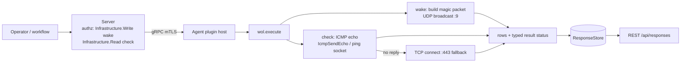

# wol

<!-- BEGIN GENERATED: plugin-doc-gen header -->
| | |
|---|---|
| **What it does** | Sends Wake-on-LAN magic packets and checks host reachability |
| **Version** | 1.0.0 |
| **Kind** | Action · mutating · gathered (device.wol.wake, device.wol.check) |
| **Platforms** | Windows ✅ · macOS ✅ · Linux ✅ |
| **Actions** | `check` (definition `device.wol.check`) · `wake` (definition `device.wol.wake`) |
| **Security** | `wake`: securable `Infrastructure` · operation Write · risk Medium · dispatch Mutating · approval gate AdminOrApproval; `check`: securable `Infrastructure` · operation Read · risk Low · dispatch ReadOnly · approval gate AdminOrApproval |
| **Roles** | execute: endpoint-admin, endpoint-operator · author: content-author |
<!-- END GENERATED -->

## How it works

`wake` builds a 102-byte magic packet — six bytes of `0xFF` followed by the target MAC repeated 16 times — and sends it once as a UDP broadcast to `255.255.255.255` on the given port (default 9). It has no way to know whether the target actually powered on, which is why `check` exists as a companion action. `check` is a pure reachability probe: it tries unprivileged ICMP echo first (native on every OS — `IcmpSendEcho` on Windows, an unprivileged ping socket on POSIX), and only spends a TCP connect on port 443 once ICMP has failed to prove reachability. `classify_check()` (`wol_check_plan.hpp`) is the single place that turns raw probe facts into a verdict, and it deliberately distinguishes "checked and got nothing" (`checked_no_reply`) from "neither mechanism could even be attempted" (`unavailable`) — the latter degrades honestly to `CONSTRAINED`/`PARTIAL` rather than being reported as a fabricated `unreachable`. Neither action shells out to an external binary; the historic `ping`/`popen` implementation was removed in favour of the native probes. `wol` is deliberately not a reachability-history or scheduling plugin — each `check` call is one point-in-time read, with polling left to the caller.



## OS capability

<!-- BEGIN GENERATED: plugin-doc-gen capability -->
| Action | Windows | macOS | Linux |
|---|---|---|---|
| `check` | ✅ supported · rung 1 · IcmpSendEcho + TCP-connect fallback | ✅ supported · rung 1 · SOCK_DGRAM ICMP ping socket + TCP-connect fallback | 🟡 constrained · rung 1 · SOCK_DGRAM ICMP ping socket + TCP-connect fallback |
| `wake` | ✅ supported · rung 1 · raw UDP broadcast socket | ✅ supported · rung 1 · raw UDP broadcast socket | ✅ supported · rung 1 · raw UDP broadcast socket |

**Declared limits per leg** (descriptor fallback text, verbatim):

- **`check` / Linux** — requires net.ipv4.ping_group_range to admit the process group for ICMP; falls back to a TCP connect on port 443, and reports CONSTRAINED if neither mechanism is usable
<!-- END GENERATED -->

## Privileges and prerequisites

| OS | Runs as | Extra grant needed | Measured | If the read is refused |
|---|---|---|---|---|
| Windows | agent service account (LocalSystem today, #1442) | `wake`: none beyond default socket access — Winsock `SOCK_DGRAM` broadcast (`wol_plugin.cpp:215`), no PowerShell; `check`: none — `IcmpSendEcho` (iphlpapi) and the TCP connect are both unprivileged | 2026-09-07, bare metal, as `SYSTEM` | not observed in any sample; `wake`'s only failure path is a `sendto` error, reported as `wake\|error\|Failed to send magic packet to <mac>` |
| macOS | agent daemon (`_yuzu`) | `wake`: none — `docs/agent-privilege-model.md:120` and `wol_plugin.cpp:215` agree: the plugin opens `SOCK_DGRAM`/`IPPROTO_UDP` (not `SOCK_RAW`), which needs no such capability — the doc's grant is over-stated for the current code, see Caveat 1. `check`: none — the unprivileged `SOCK_DGRAM` ICMP ping socket "works out of the box on macOS" (`icmp_probe.hpp:19-20`) | 2026-09-07, bare metal, at euid 501 (unprivileged) | not observed; no permission-denied path is exercised in code or samples |
| Linux | agent daemon (`yuzu`) | `wake`: none — `docs/agent-privilege-model.md:120` and `wol_plugin.cpp:215` agree: the plugin opens `SOCK_DGRAM`/`IPPROTO_UDP` (not `SOCK_RAW`), which needs no such capability — see Caveat 1. `check`: no agent-side grant — the unprivileged ICMP ping socket needs the *host's* `net.ipv4.ping_group_range` sysctl to admit the process's group, else the leg falls back to the TCP-connect probe (`matrix.md`) | 2026-09-06, container, at euid 0 (root) — see Caveats: the capture never ran unprivileged | a denied ICMP socket open (`EACCES`/`EPERM`) sets `icmp_session_ok=false` (`icmp_probe.hpp:370`) and the action silently falls through to the TCP fallback rather than surfacing a distinct error |

No subprocess is spawned by either action — the historic `ping`/`popen` shell-out was removed (`changelog.d/20260818-wave2-network-actions-wol-services-native-argv.changed.md`). `wake` opens a UDP datagram socket; `check` opens an unprivileged ICMP ping socket (POSIX) or calls `IcmpSendEcho` (Windows), plus a TCP connect socket on port 443 as fallback. Network only — no filesystem or registry access.

## Data contract

### Inputs

<!-- BEGIN GENERATED: plugin-doc-gen inputs -->
| Definition | Parameter | Type | Required | Default | Constraints | Description |
|---|---|---|---|---|---|---|
| `device.wol.check` | `host` | string | yes | - | pattern: ^[a-zA-Z0-9.:\-]+$ · minLength 1 · maxLength 253 | Hostname or IPv4/IPv6 address to check for reachability, e.g. 192.168.1.50 or desktop-01.example.com. Must contain only alphanumeric characters, dots, hyphens, and colons. |
| `device.wol.check` | `count` | string | no | 3 | pattern: ^[0-9]+$ | Number of probe samples attempted per mechanism (1-10); each mechanism stops early on a positive result. Defaults to 3 if not specified. |
| `device.wol.wake` | `mac` | string | yes | - | pattern: ^([0-9A-Fa-f]{2}[:\-]){5}[0-9A-Fa-f]{2}$ · minLength 17 · maxLength 17 | Target MAC address in colon or hyphen-separated format (e.g., AA:BB:CC:DD:EE:FF or AA-BB-CC-DD-EE-FF). |
| `device.wol.wake` | `port` | string | no | 9 | pattern: ^[0-9]+$ | UDP port for the magic packet broadcast. Standard WoL port is 9. Some setups use port 7 or other values. |
<!-- END GENERATED -->

### Outputs

Every action writes pipe-delimited rows via `write_output()`; field 0 is a literal discriminator matching the action name. `wake`'s field count is not constant — an error row carries only `status|message`; `port` and `bytes_sent` are appended only on the success path, never padded with `-`. `check` additionally emits a second, separate row discriminated `mechanism` — a real output field that is not declared in `result.columns` below (see Caveats).

<!-- BEGIN GENERATED: plugin-doc-gen outputs -->
**`device.wol.check` — `host|status|count`**

| Field | Type | Values | Available | Example | Description |
|---|---|---|---|---|---|
| `host` | string | - | Windows, Linux, macOS | `127.0.0.1` | The `host` parameter value, echoed back unmodified. Values: free text (hostname or IP literal). |
| `status` | string | - | Windows, Linux, macOS | `reachable` | Reachability verdict: `reachable` if either mechanism produced a positive result, `unreachable` if both were genuinely attempted with no positive result, or `unavailable` if neither mechanism could even be attempted. Values: reachable, unreachable, unavailable. |
| `count` | string | - | Windows, Linux, macOS | `3` | The `count` parameter value, echoed back as a string. Values: integer 1-10, as a string. |

**`device.wol.wake` — `status|message|port|bytes_sent`**

| Field | Type | Values | Available | Example | Description |
|---|---|---|---|---|---|
| `status` | string | - | Windows, Linux, macOS | `error` | Outcome of the magic-packet send attempt. Values: error, success. |
| `message` | string | - | Windows, Linux, macOS | `Missing required parameter: mac` | Failure reason on `error`, or a confirmation of the packet sent on `success`. Values: free text. |
| `port` | string | - | Windows, Linux, macOS | `not observed in any capture (code: wol_plugin.cpp:249)` | The UDP port the magic packet was sent to, formatted as `port <n>`; emitted only on `success`. Values: `port <n>` (formatted string, not a bare number). |
| `bytes_sent` | string | - | Windows, Linux, macOS | `not observed in any capture (code: wol_plugin.cpp:249)` | Number of bytes sent, formatted as `<n> bytes`; emitted only on `success`. Values: `<n> bytes` (formatted string, not a bare number). |
<!-- END GENERATED -->

**Supplementary `mechanism` row.** `check` always emits a second row, `mechanism|<label>`, immediately after the `check` row. `<label>` is one of `icmp`, `tcp-fallback`, `tcp-refused`, `icmp+tcp-fallback` (both mechanisms genuinely attempted, neither succeeded), or `unavailable` (neither could be attempted) — `wol_check_plan.hpp:96-113`.

### Result status

| Status | Completeness | Provenance | When |
|---|---|---|---|
| `CONSTRAINED` | `PARTIAL` | `wol_plugin:check_unavailable` | `check` only, when neither ICMP nor the TCP fallback could even be attempted (`wol_plugin.cpp:358-359`) |

Every other outcome — `wake`'s success/error paths, and `check`'s `reachable`/`unreachable`/`checked_no_reply` verdicts — never calls `set_result_status`; the agent records `UNDECLARED`/`UNKNOWN`, which is what every captured sample shows below, including a genuine `reachable` `check`.

### Where the data goes

- **Instruction result only.** Rows travel over the agent's mTLS gRPC channel as the command response and land in the ResponseStore, queryable at `/api/responses/{id}`.
- **Not consumed by** daily-sync inventory, the TAR warehouse, DEX, or metrics — grepping the server tree for `wol` finds only the capability-declaration rows in `plugin_action_catalogue_c.hpp`; nothing else reads this plugin's output.
- **Sensitivity.** `check`'s `host` row echoes back the caller-supplied hostname or IP address being probed — a device identifier. `wake` has no declared identifying column, though its uncaptured success-path `message` text likely names the target MAC address as confirmation text (see Caveat 3 — never observed in a sample). Neither action's rows carry a person's identity or installed-software information.
- **Siblings:** `network.probe.icmp` / `network.probe.tcp` (`netprobe.yaml`) share `check`'s underlying `icmp_probe.hpp` mechanism for their own reachability probes.
- **MCP / REST.** Discover: `discover_plugins` (summary) → `yuzu://plugin-docs` (this page as data) → `discover_instructions` / `get_definition("device.wol.wake")`. Run: `execute_instruction {definition_id, parameters}`. Read: `/api/responses/{id}`.

## Sample output

<!-- BEGIN GENERATED: plugin-doc-gen samples -->
**Windows** — captured: windows Microsoft Windows NT 10.0.26200.0 x64 · bare-metal · 2026-09-07 · SYSTEM · leg-hash dcc02549b1eb

```
== action=wake
wake|error|Missing required parameter: mac
[result_status] UNDECLARED / UNKNOWN
[rc] 1

== action=check host=127.0.0.1
check|127.0.0.1|reachable|3
mechanism|icmp
[result_status] UNDECLARED / UNKNOWN
```

**macOS** — captured: macos macOS 26.6.2 arm64 · bare-metal · 2026-09-07 · euid 501 (alex) · leg-hash dcc02549b1eb

```
== action=wake
wake|error|Missing required parameter: mac
[result_status] UNDECLARED / UNKNOWN
[rc] 1

== action=check host=127.0.0.1
check|127.0.0.1|reachable|3
mechanism|icmp
[result_status] UNDECLARED / UNKNOWN
```

**Linux** — captured: linux Debian GNU/Linux 13 (trixie) aarch64 · container · 2026-09-06 · euid 0 · leg-hash dcc02549b1eb

```
== action=wake
wake|error|Missing required parameter: mac
[result_status] UNDECLARED / UNKNOWN
[rc] 1

== action=check host=127.0.0.1
check|127.0.0.1|reachable|3
mechanism|icmp
[result_status] UNDECLARED / UNKNOWN
```
<!-- END GENERATED -->

## Caveats and known gaps

1. **`wake` needs no elevated privilege.** The plugin opens a plain `SOCK_DGRAM`/`IPPROTO_UDP` broadcast socket on every OS (`wol_plugin.cpp:215`) — no `SOCK_RAW`, so no `cap_net_raw` or root; `docs/agent-privilege-model.md:120` states the same. Earlier revisions of that row claimed a `cap_net_raw` grant; treat any remaining reference to it elsewhere as stale.
2. **`check` accepts an undeclared `timeout_ms` parameter.** The code reads `timeout_ms` (default `1000` ms, clamped 100-5000; `wol_plugin.cpp:290-298`), but `content/definitions/wol.yaml`'s `check` parameters declare only `host` and `count` — an operator calling through the definition schema has no way to set it, and it silently stays at 1000 ms.
3. **`wake`'s success-path output was never captured.** Both fixture runs deliberately rejected `wake` for a missing `mac` (an Irreversible, AdminOrApproval-gated action), so the `port`/`bytes_sent` field shapes in this README are derived from source (`wol_plugin.cpp:248-249`), not observed in any sample — the Outputs table marks those examples as such rather than showing a captured value.
4. **The Linux sample ran as root, not the unprivileged path `check`'s fallback exists for.** `linux.txt` was captured at euid 0 in a container, so the ICMP-denied → TCP-fallback branch (`net.ipv4.ping_group_range`) was never actually exercised by any sample; every OS sample shows the same plain-ICMP-succeeds path.
5. **The historic shelled-out `ping` is gone; do not reintroduce it.** `check` used to spawn a system `ping` via `popen` (rung 3); the migration to native ICMP + TCP-connect fallback removed the last subprocess spawn from this plugin (`changelog.d/20260818-wave2-network-actions-wol-services-native-argv.changed.md`). `icmp_probe.hpp`'s own header comment (lines 6-10) is stale — it still describes `wol.check` as an unmigrated shell-out that "still spawns the system `ping` binary"; the plugin's actual behaviour is the native path in `wol_plugin.cpp`.

## Source and tests

<!-- BEGIN GENERATED: plugin-doc-gen source -->
- Plugin: `agents/plugins/wol/src/wol_check_plan.hpp` · `agents/plugins/wol/src/wol_plugin.cpp`
- Definitions: `content/definitions/wol.yaml`
- Capability rows: `server/core/src/capability_decls/plugin_action_catalogue_c.hpp`
- Tests: `tests/unit/test_wol_check_plan.cpp`
- Privilege row: `docs/agent-privilege-model.md`
- Changelog: `changelog.d/20260818-wave2-network-actions-wol-services-native-argv.changed.md` · `changelog.d/2209-wol-macos-ping-timeout.added.md`
<!-- END GENERATED -->
