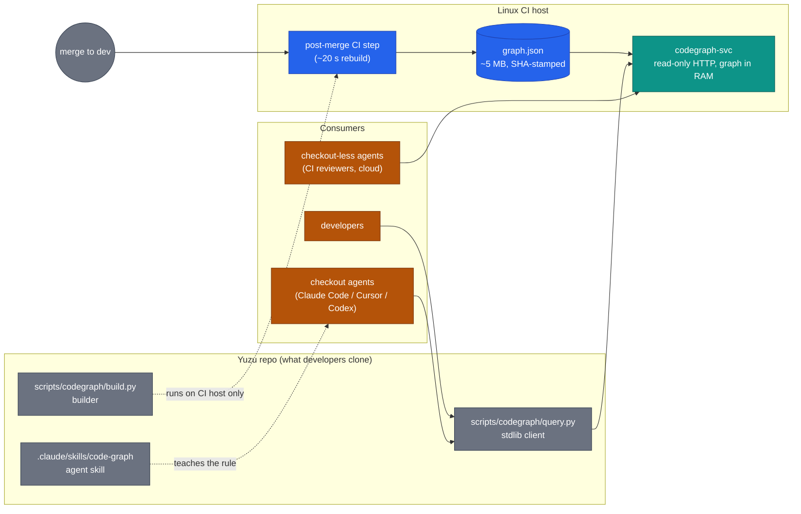
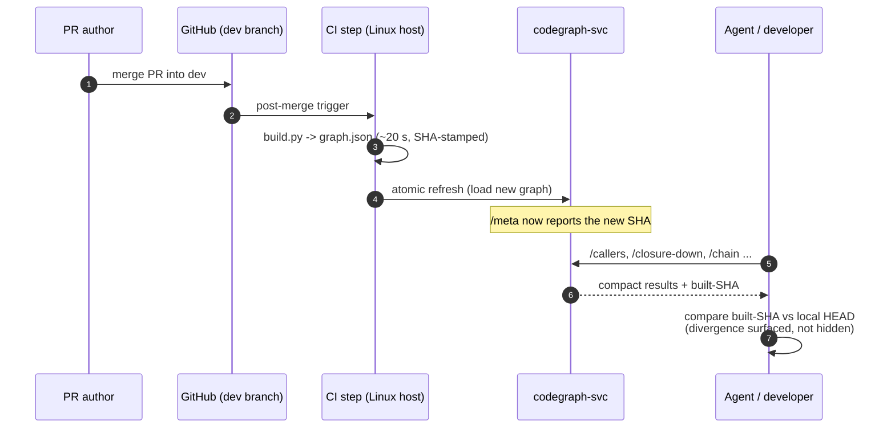
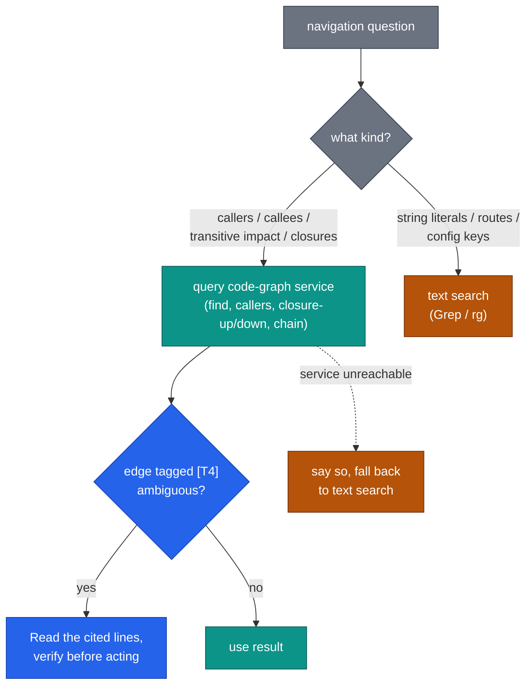

# ADR-3006 — Central code-graph service for developer and agent navigation

## Context

AI agents (and developers) navigating Yuzu's ~445k-LOC C++23 codebase rely on text search. A controlled,
pre-registered experiment (29 runs, 3 arms × 3 traversal task shapes, consensus-scored, spot-adjudicated)
measured a queryable call graph's effect:

| Arm | Deep-closure quality (F1) | Wall-clock (median) | Tokens vs grep |
|---|---|---|---|
| grep-only | 0.69–0.84 (25–35% of impact set silently missed) | 1235 s | baseline |
| graph-only | 1.00 | 452 s | wins closures, LOSES string/route tasks 2.2x |
| **hybrid (graph + text, agent chooses)** | **0.96–1.00** | **238 s** | **1.2–1.6x fewer** |

Agents allocate between graph and text correctly when given both (tool-mix logged). Compiler-precise
extraction is not deployable on developer machines (scip-clang emits no member-call refs; both available
libclang builds drop lambda bodies; CodeQL needs a provisioned Linux host; the turnkey tool evaluated
failed its index gate). The deployable graph tier is heuristic (universal-ctags extents/scopes/typerefs +
tree-sitter call extraction, tiered name resolution T0–T4) and the measurements above are OF that tier.

We choose a **single central instance** over per-developer local builds: one always-fresh truth, zero
consumer dependencies, reach for checkout-less agents (CI-side reviewers, cloud agents), and — decisive
for the future — the central Linux host is the only place a CodeQL-precise edge tier can ever be built
(laptops cannot), so central is where precision gets added later without any client change.

## Decision

Deploy the code graph **exclusively as a central, self-hosted, read-only service**; the repo ships the
builder (run by CI), a zero-dependency client, and the agent skill. No local graph builds in the
developer workflow.

1. **Builder — `scripts/codegraph/build.py`** (runs on the Linux CI host, post-merge): universal-ctags
   (function extents, scopes, member typerefs) + tree-sitter via `tree-sitter-language-pack` (call
   extraction), tiered resolution (T0 receiver-typed / T1 same-class / T2 same-file / T3 unique /
   T4 ambiguous fan-out, tier recorded per edge), lambdas attributed to enclosing named functions.
   Output `graph.json` (~5 MB) stamped with the built commit SHA. C++ production surface v1
   (server/, agents/, sdk/, proto/; tests excluded). Builder dependencies exist ONLY on the CI host.
2. **Service — `codegraph-svc`** (container on the Linux CI host, internal network only): read-only
   HTTP JSON API mirroring the query verbs — `/find /callers /callees /closure-up /closure-down /chain
   /stats /meta /health` — loading `graph.json` into memory (no database; a 5 MB in-RAM graph needs
   none). `/meta` returns the built SHA + timestamp. Auth: static bearer token from the existing
   internal secret channel. Availability is best-effort dev tooling — **no SLO**.
3. **Freshness**: a post-merge CI step on the dev branch rebuilds `graph.json` (~20 s) and refreshes the
   service atomically. This is a deliberate new precedent (the repo has no green-merge artifact jobs);
   it is a service refresh, not a retained artifact, and MUST lead with explicit status functions per
   the CI invariants. The graph therefore always reflects dev HEAD within one CI cycle.

4. **Client — `scripts/codegraph/query.py`**: Python-stdlib-only HTTP client (zero pip installs, all
   platforms including Windows), same verbs, compact `file:line name [tier]` output with `--limit`
   caps. `CODEGRAPH_URL`/`CODEGRAPH_TOKEN` env with committed internal default URL. Prints the
   service's built-SHA vs local HEAD delta so users see divergence from their working tree.
5. **Agent integration** — `.claude/skills/code-graph/SKILL.md` (repo-local; loads for anyone in the
   checkout) + one CLAUDE.md `## Context discipline` bullet (mirrored in AGENTS.md; CODEX.md route
   bullet). The normative rule: **for callers/callees/transitive-impact/closure questions query the
   code-graph service FIRST; use text search for string literals, routes, and config keys; verify
   surprising [T4] edges by reading the cited lines; if the service is unreachable, say so and fall
   back to text search.**

6. **Scope and non-goals**:
   - **NEVER** part of product binaries, customer deployments, or the shipped MCP server's tool
     surface. The service maps this repo's internals and lives on internal infrastructure only — a
     security product does not publish its own source map.
   - **No graph database / no Postgres**: measured value requires none; the store is a JSON file in
     RAM. (ADR-0004's graph-over-Postgres pattern concerns the product's fleet graph — unrelated.)
   - **C++ v1**; Erlang gateway via OTP xref is a filed follow-up. **Heuristic tier v1**; CodeQL
     precise edges on this same host is the named upgrade path, deferred until a security-grade
     use-case funds it.
   - The client CLI reads the remote service only; local building remains possible for tool
     development but is not a supported developer workflow.

## Ownership and maintenance

This is **bespoke in-repo tooling, not a vendored product** — no third-party codegraph survived
evaluation (turnkey tool failed its index gate; scip-clang cannot emit C++ member-call references).
The capability comprises ~600 lines of Python plus two pinned OSS dependencies (universal-ctags,
tree-sitter grammars), which exist only on the CI host.

- **Capability owner:** @Doomgoose — accountable for the builder/client/skill code and this ADR.
- **Operation:** unattended. CI rebuilds the graph post-merge; the service container restarts on
  failure; there is no SLO and no on-call. Consumers degrade to text search when it is unreachable.
- **Host operations:** the runner-host owner (deploy, container runtime, network exposure) — the
  same shared-ops arrangement as the existing self-hosted runners.
- **Maintenance model:** the code is repo code — changes go through the normal PR gates; the
  co-located fixture tests plus the answer-key regression run on every graph rebuild, so extraction
  drift (ctags/tree-sitter upgrades) is caught by CI rather than by users. Bus-factor risk is
  accepted for a no-SLO dev tool and mitigated by the tool's size (~600 lines, stdlib client).

## Considered alternatives

- **Local per-developer builds (CLI-only, no service)** — captures the same measured navigation win for
  developers with checkouts and works offline, but: per-dev deps (ctags+pip), per-dev staleness, no
  reach for checkout-less agents, and no home for the precise tier. Rejected by owner preference for a
  single always-fresh instance; revisit only if the service's network dependency proves painful.
- **Hybrid local+central** — both modes over one schema; rejected v1 as maintenance of two consumption
  paths for one audience; the client/service split preserves the option cheaply.
- **Postgres/graph-DB-backed shared service (original plan)** — rejected on measurement: a 5 MB in-RAM
  graph gains nothing from a database.
- **Turnkey tools (CodeGraphContext/Graphify class)** — failed index-quality gate; no Erlang path.
- **CI artifact downloads instead of a service** — still per-consumer staleness + no query API; the
  service IS the freshness mechanism.
- **Do nothing** — grep-only agents silently missed 25–35% of deep impact sets; rejected.

## Consequences

**Positive:** one always-fresh graph for every consumer (humans, checkout agents, checkout-less agents);
zero consumer dependencies (stdlib client — Windows/macOS/Linux identical); agents stop silently
truncating impact analyses (F1→~1.0) and answer traversal questions ~5x faster; single place to upgrade
edges to CodeQL-precise later with no client change.
**Negative / accepted:** graph value now requires network reach to the CI host — offline work and
service outages degrade agents to text-search-only (the skill's fallback clause makes this explicit and
non-fatal); the service serves dev-HEAD, so agents on feature branches see a graph a few commits behind
their working tree (delta surfaced via /meta vs local HEAD; acceptable — branch diffs are small);
running one more internal container + a post-merge CI step (new precedent, stated).
**Risk:** ctags/tree-sitter version drift on the CI host changes extraction — pinned versions in the
builder image + a fixture regression test (`scripts/codegraph/test_codegraph.py`, pure string fixtures
per the repo's test-efficiency discipline) + an answer-key regression (the two same-named `audit_log`
functions and their caller structure) run in CI against every rebuilt graph. Host access for deployment
requires runner-host coordination (see Rollout).

## Verification (obligations on the implementing PR)

1. Builder on the CI host completes ≤60 s; the post-rebuild CI check asserts the answer-key structure
   (AuthRoutes::audit_log vs ServerImpl::audit_log caller sets) via the service API.
2. `test_codegraph.py` passes (pure fixtures: tier resolution, lambda attribution, extent joins).
3. Client smoke-tested from macOS, Linux, and Windows (the-rig) against the live service — transcripts
   in the PR body; unreachable-service fallback message demonstrated.
4. Freshness: a merge to dev refreshes /meta's SHA within one CI cycle.
5. Skill + CLAUDE.md/AGENTS.md/CODEX.md edits land with the client; /governance on the range; suites
   via /test where applicable.

## Rollout

PR 1: this ADR (proposed). PR 2: builder + service + client + skill + doc edits; service deployed to
the Linux CI host — **requires runner-host access, coordinate with @Tr3kkR/host owner**; on live
deployment + three-platform validation this ADR flips to accepted. Follow-up issues at PR-2 time:
Erlang xref backend; CodeQL precise tier trigger; service-outage telemetry if fallback proves frequent.
