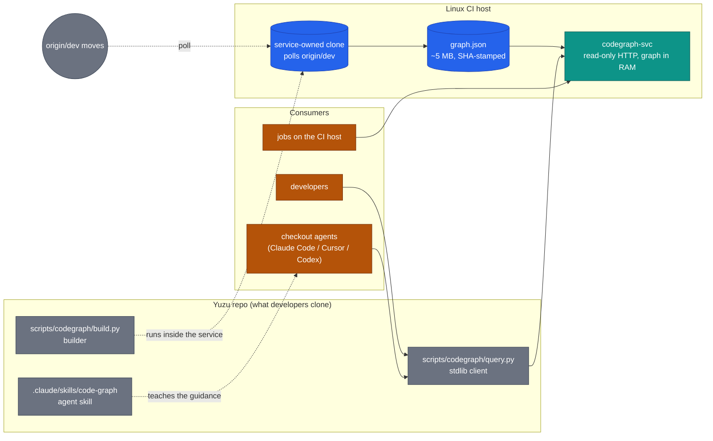
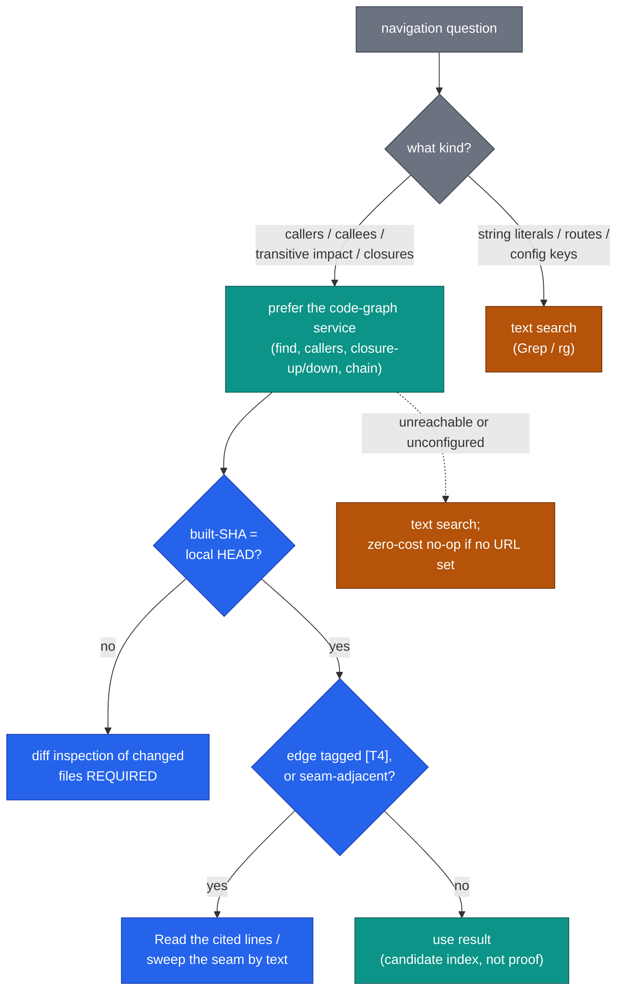

# ADR-3006 — Central code-graph service for developer and agent navigation

## Context

AI agents (and developers) navigating Yuzu's ~445k-LOC C++23 codebase rely on text search. An
internal prototype experiment motivated this proposal:

**Prototype observation (internal, unverified).** 29 agent runs across 3 navigation arms × 3
traversal task shapes, consensus-scored with author adjudication — approximately 3 observations per
cell, not independently reproduced. These figures motivate the direction; they do not prove the
magnitudes, and the acceptance evidence below is what would.

| Arm | Deep-closure quality (F1) | Wall-clock (median) | Tokens vs grep |
|---|---|---|---|
| grep-only | 0.69–0.84 (25–35% of impact set silently missed) | 1235 s | baseline |
| graph-only | 1.00 | 452 s | wins closures, LOSES string/route tasks 2.2x |
| **hybrid (graph + text, agent chooses)** | **0.96–1.00** | **238 s** | **1.2–1.6x fewer** |

Agents allocated between graph and text correctly when given both (tool-mix logged). One structural
limit of this evidence: it supports *building a queryable graph*; it does not by itself support
*centralising it exclusively*, because deployment topology was never an experimental arm — see
"Unsettled" below.

Compiler-precise extraction is not deployable on developer machines (scip-clang emits no member-call
references; both available libclang builds drop lambda bodies; the turnkey tool evaluated failed its
index gate). The repo's existing daily CodeQL job already runs full traced C++ analysis on the Linux
CI host, so a precise call-edge tier is nearer than the heuristic framing suggests — the remaining
work is the call-edge query, export format, and schema integration, not host provisioning. The
deployable tier TODAY is heuristic (universal-ctags extents/scopes/typerefs + tree-sitter call
extraction, tiered name resolution T0–T4), and the observations above are OF that tier.

We propose a **single central instance** as the direction: one always-fresh truth for the committed
codebase, zero consumer dependencies, and a single place where the CodeQL-precise edge tier can
later replace heuristic edges with no client change. Whether central should be *exclusive* is
explicitly unsettled (below).

## Decision

Deploy the code graph as a **central, self-hosted, read-only service**; the repo ships the builder,
a zero-dependency client, and the agent skill. Local graph builds are not part of the supported v1
workflow — see "Unsettled" for the condition under which that changes.



1. **Builder — `scripts/codegraph/build.py`**: universal-ctags (function extents, scopes, member
   typerefs) + tree-sitter via `tree-sitter-language-pack` (call extraction), tiered resolution
   (T0 receiver-typed / T1 same-class / T2 same-file / T3 unique / T4 ambiguous fan-out, tier
   recorded per edge), lambdas attributed to enclosing named functions. Output `graph.json` (~5 MB)
   stamped with the built commit SHA. C++ production surface v1 (server/, agents/, sdk/, proto/).
   **Tests are excluded in v1**, so real impact sets — which include test callers — are NOT fully
   represented: impacted-test discovery MUST NOT rely on the graph alone. Builder dependencies
   exist ONLY on the CI host.
2. **Service — `codegraph-svc`** (container on the Linux CI host, internal network only): read-only
   HTTP JSON API — `/find /callers /callees /closure-up /closure-down /chain /stats /meta /health`
   — loading `graph.json` into memory (no database; a 5 MB in-RAM graph needs none). `/meta`
   returns built SHA + build timestamp + graph age. Auth: static bearer token from the existing
   internal secret channel. Availability is best-effort dev tooling — **no SLO**. **Why
   internal-only:** the source is public and anyone can run the builder against their clone, so
   confidentiality of the graph is not the argument; the argument is attack surface — a queryable
   service co-resident with CI infrastructure is exposure we choose not to add to, and the service
   therefore listens on the internal network only. **Staleness posture is serve-stale, explicitly:**
   if a rebuild fails, the service keeps serving the last good graph with its SHA and age visible in
   `/meta` and in every client banner; consumers judge divergence, and a red rebuild is visible on
   the service's own status endpoint.
3. **Freshness — the service PULLS.** `codegraph-svc` owns its own clone and its own identity,
   polls `origin/dev`, rebuilds (~20 s) when it moves, and swaps the in-RAM graph atomically,
   asserting the new SHA is a **descendant** of the currently served one (monotonic publication —
   a late, older rebuild can never replace a newer graph). There is **no CI push step and no write
   path into the service from CI jobs**: PR-triggered jobs on the shared runner identity have
   nothing to write to. Publication of build outputs on merge is not itself new for this repo
   (runner images and the docs site already publish post-merge); a long-lived queryable service on
   the CI host IS new, and the isolation obligations that follow are listed under Rollout for the
   implementing PR.

```mermaid
sequenceDiagram
    autonumber
    participant GH as GitHub (dev branch)
    participant Svc as codegraph-svc (own clone + identity)
    participant Agent as Agent / developer

    GH-->>Svc: origin/dev moves (service polls)
    Svc->>Svc: fetch; build.py -> graph.json (~20 s, SHA-stamped)
    Svc->>Svc: assert new SHA descends from served SHA
    Svc->>Svc: atomic in-RAM swap
    Note over Svc: /meta reports new SHA + age; on a failed build,<br/>last good graph keeps serving, age grows visibly
    Agent->>Svc: /callers, /closure-down, /chain ...
    Svc-->>Agent: compact results + built-SHA
    Agent->>Agent: built-SHA != local HEAD?<br/>diff inspection of changed files is REQUIRED
```

4. **Client — `scripts/codegraph/query.py`**: Python-stdlib-only HTTP client (zero pip installs,
   all platforms including Windows), same verbs, compact `file:line name [tier]` output with
   `--limit` caps. Configuration is **`CODEGRAPH_URL`/`CODEGRAPH_TOKEN` environment only — no URL
   is committed to the repo** (a public repo does not publish internal endpoints; the URL travels
   via the internal secret channel alongside the token). **Unset URL ⇒ the client and the skill
   skip the graph entirely, silently and instantly — no network call** — so forks and external
   contributors get a zero-cost no-op, not a doomed connection attempt. When set, the client uses a
   bounded connect timeout (≤2 s) and reports the service's built-SHA against local HEAD on every
   query.
5. **Agent integration** — ONE canonical statement of the navigation guidance lives in
   `.claude/skills/code-graph/SKILL.md`; CLAUDE.md `## Context discipline`, AGENTS.md, and CODEX.md
   carry one-line pointers to it, not copies. The guidance:
   - **Prefer the code-graph service for callers/callees/transitive-impact/closure questions** —
     it is usually faster and more complete than iterative text search. Use text search for string
     literals, routes, and config keys. If the service is unreachable or unconfigured, use text
     search and (when configured) say so.
   - **This is guidance, not an invariant.** It does not gate governance, it is not policy-floor
     source material on acceptance of this ADR, and reaching for text search first is never a
     finding. Explicitly subordinate: governance domain routing (Step 0 / Gate 8) matches changed
     git paths against `.claude/routed-concerns.md` and NEVER substitutes graph closure output for
     that matching.
   - **Graph output is a candidate-edge index, never closure proof.** Tiers T0–T4 label the
     confidence of edges the extractor FOUND; an edge the extractor missed carries no label at all
     and the closure simply looks complete. Indirect-dispatch seams — `std::function` targets,
     virtual calls, plugin function pointers, route-registration lambdas, generated dispatch — and
     all test callers are exactly where missing edges concentrate. Impact and completeness claims
     therefore still require diff or text inspection across those seams.
   - **When the service's built-SHA differs from local HEAD, diff inspection of the changed files
     is REQUIRED, not advisory** — on a feature branch the missing edge is usually the edge under
     review, and knowing the graph is stale does not recover it.



6. **Scope and non-goals**:
   - **NEVER** part of product binaries, customer deployments, or the shipped MCP server's tool
     surface. The service is development tooling on internal infrastructure; the product is not a
     consumer and never gains a dependency on it.
   - **No graph database / no Postgres**: the store is a JSON file in RAM. (ADR-0004's
     graph-over-Postgres pattern concerns the product's fleet graph — unrelated.)
   - **C++ v1**; Erlang gateway via OTP xref is a filed follow-up. **Heuristic tier v1**; the
     CodeQL precise edge tier — for which the daily traced job on this host already exists — is
     the named upgrade path, adopted when the acceptance evidence justifies it.
   - The graph never carries a security control: nothing in governance, review, or release may
     treat graph output as authoritative evidence of impact or reachability.

## Unsettled — central exclusivity

The central instance is the decided direction; **exclusive**-central is provisional. The honest
driver for central is operational (one fresh instance, one upgrade point for precise edges) — the
checkout-less-reach argument is weaker than first framed, since GitHub-hosted CI legs and off-network
cloud agents cannot reach an internal service; and a dev-HEAD graph structurally cannot answer the
feature-branch question ("what does MY change affect") exactly. A local-build tier — same builder,
same schema, built against the working tree — is the only topology that can. Whether that tier is
worth its per-developer dependency cost is an empirical question this prototype did not measure
(topology was not an arm).

**The settling measurement:** the implementing PR's pilot includes a topology arm — central-only vs
hybrid-local (same tasks, same scoring) — and its result is acceptance evidence. If hybrid-local
materially outperforms on feature-branch tasks, this ADR is amended to the two-tier shape before
acceptance rather than after.

## Ownership and maintenance

This is **bespoke in-repo tooling, not a vendored product** — no third-party codegraph survived
evaluation (turnkey tool failed its index gate; scip-clang cannot emit C++ member-call references).
The capability comprises ~600 lines of Python plus two pinned OSS dependencies (universal-ctags,
tree-sitter grammars), which exist only on the CI host.

- **Capability owner:** @Doomgoose — accountable for the builder/client/skill code and this ADR.
- **Operation:** unattended. The service polls and rebuilds itself; the container restarts on
  failure; there is no SLO and no on-call. Consumers degrade to text search when it is unreachable.
- **Host operations:** the runner-host owner (deploy, container runtime, network exposure) — the
  same shared-ops arrangement as the existing self-hosted runners.
- **Maintenance model:** the code is repo code — changes go through the normal PR gates; the
  co-located fixture tests plus the answer-key regression run on every graph rebuild, so extraction
  drift (ctags/tree-sitter upgrades) is caught by the service rather than by users. Bus-factor risk
  is accepted for a no-SLO dev tool and mitigated by the tool's size (~600 lines, stdlib client).

## Considered alternatives

- **Local per-developer builds (CLI-only, no service)** — answers feature-branch questions exactly
  and works offline, at the cost of per-dev dependencies and per-dev staleness, with no shared
  instance for the future precise tier. Not rejected: deferred pending the topology measurement
  above.
- **Hybrid local+central** — the two-tier shape the topology arm evaluates; adopted by amendment if
  the measurement says so.
- **Postgres/graph-DB-backed shared service (original plan)** — rejected: a 5 MB in-RAM graph gains
  nothing from a database.
- **Turnkey tools (CodeGraphContext/Graphify class)** — rejected: failed the index-quality gate; no
  Erlang path.
- **CI-push refresh (this ADR's own first draft)** — rejected in review: it created a write path
  into the service from the shared runner identity, an out-of-order publication risk, and a CI-step
  precedent, all of which the pull model removes.
- **CI artifact downloads instead of a service** — per-consumer staleness and no query API.
- **Do nothing** — the prototype observation (grep-only agents silently missing 25–35% of deep
  impact sets) is unverified but directionally alarming enough that "no structural index" needs
  positive justification; rejected.

## Consequences

**Positive:** one always-fresh graph of the committed codebase for every reachable consumer; zero
consumer dependencies (stdlib client — Windows/macOS/Linux identical); a single place to upgrade
edges to CodeQL-precise with no client change; no write path from CI jobs into the service.
**Negative / accepted:** graph value requires network reach to the CI host — offline work, forks,
and external contributors get a zero-cost no-op and plain text search; the service serves dev-HEAD,
so feature-branch divergence is inherent (mitigated by the REQUIRED diff-inspection rule, and
addressed structurally only by the local tier if the topology measurement adopts it); serve-stale
means a broken rebuild ages the graph visibly rather than failing closed — consumers must heed the
age; one more internal container on the CI host.
**Risk:** extraction drift from ctags/tree-sitter upgrades — pinned versions plus fixture tests and
the answer-key regression on every rebuild. Missing-edge blindness at indirect-dispatch seams is
inherent to the heuristic tier — mitigated by the candidate-index framing and seam rules in the
skill, measured by the seam fixtures and gold-set sample below, and structurally closed only by the
precise tier. Host access for deployment requires runner-host coordination (see Rollout).

## Acceptance evidence

Operational validation (deploys cleanly; client works on macOS, Linux, and Windows including
the-rig; staleness banner and no-op fallback behave as specified) is a **precondition, not the
decider**. Moving this ADR to `accepted` requires decider sign-off on evidence that speaks to the
decision itself:

1. **Seam fixtures with mutation testing** — fixtures for `std::function` assignment/invocation,
   route-registration lambdas, virtual overrides, plugin C function pointers, overloaded names,
   templates, macros; each fixture is validated by breaking its edge and requiring the test to
   redden. Falsifier: any predefined security-relevant edge silently omitted, or recall achieved
   only through unusably broad T4 fan-out.
2. **Blind gold-set sample on real code** — stratified roots across ordinary calls, routes,
   auth/RBAC chokepoints, command dispatch, plugin ABI, virtual interfaces, and test callers; gold
   sets built blind to graph output; precision/recall reported **per tier and per seam**.
3. **CodeQL cross-check** — call edges exported from the existing daily CodeQL job diffed against
   the same gold set. If a precise export fits the existing schedule and materially beats the
   heuristic, the heuristic-first premise is revisited before acceptance.
4. **The topology arm result** (see Unsettled).
5. **Feature-branch staleness replay** — recent PRs replayed at PR SHA vs dev SHA vs deliberately
   stale SHA; REQUIRED-diff-inspection vs warn-only compared. If forced inspection is what
   recovers correctness, the rule stays REQUIRED.
6. **Shared-identity red team** — from a PR job on the CI host, attempt to reach or modify the
   service's clone, build inputs, or served graph. Pass condition: the write path is provably
   unreachable from PR jobs.

## Rollout

PR 1: this ADR (`status: proposed`). PR 2: builder + service + client + skill + doc pointers;
service deployed to the Linux CI host — **requires runner-host access; coordinate with @Tr3kkR /
the host owner**. PR 2's specification obligations, deliberately not designed in this ADR: API
versioning; traversal depth and result caps (closure expansion must not be a cheap way to load the
host); per-response graph SHA; TLS and token rotation; container isolation and resource limits
against CI contention; the descendant-SHA publication assert; service status surfacing (age, last
rebuild result). Follow-up issues at PR-2 time: Erlang gateway xref backend; CodeQL precise-tier
adoption decision; fallback-frequency telemetry if outages prove common.

Acceptance: per the Acceptance evidence section, by decider sign-off — never automatic.
