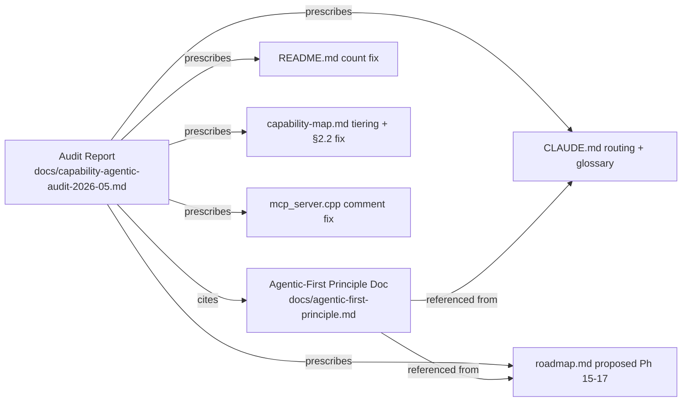

# Capability & Agentic-Readiness Audit — Refined Plan

**Date:** 2026-05-01
**Scope:** Refine the supplied draft into an actionable audit deliverable, grounded in verified code/doc state. The user's framing is **agentic-first**: every operation a human can perform via the dashboard must be performable by an LLM-driven worker through a documented, discoverable, machine-readable surface.

## Context

The supplied draft was written from memory and contains several factually wrong claims that, if used to drive doc/roadmap edits, would propagate noise. Verified during plan exploration:

| Draft claim | Actual state (verified) |
|---|---|
| capability-map says 225 / 166 / **74%** | capability-map.md:35 says **208 / 165 / 79%** |
| README says 184 / 150 / **82%** | README.md:239 says **184 / 150 / 82%** ← stale, but draft's number is right |
| "Phase 15 TAR + Scope Walking" | TAR is roadmap **Issue 7.19 — Done**; no Phase 15 exists |
| "Phase 16 Guardian (2 of 15 PRs)" | No numbered phase; Guardian is tracked separately in CLAUDE.md PR ladder |
| "Phase 17" hole | Roadmap stops at **Phase 14**; Phase 17 would be net-new |
| `docs/scope-walking-design.md`, `docs/tar-dashboard.md`, `docs/tar-implementer.md` | None of these files exist |
| "MCP Phase 2 not on roadmap" | **Issue 13.5** already plans `set_tag`, `delete_tag`, `approve_request`, `reject_request`, `quarantine_device` + SSE for execution progress |
| "capability-map §2.2: scope/filter targeting NOT implemented" vs "asset-tagging-guide says it works" | **Code wins** — `agent_registry.cpp:838-847` resolves `tag:X`, `props.X`, `ostype`, `hostname`, `arch`, `agent_version`. capability-map §2.2 is wrong; asset-tagging-guide is right |
| "set_tag, delete_tag implemented as MCP write tools" | `mcp_server.cpp` has them in `kToolSecurity`/`kWriteTools` and a misleading "Implemented:" comment, but **no dispatch handler** — only `execute_instruction` is wired (line 1313). They fall through to "Unknown tool" |
| "230 markdown files, 15 unrouted" | `docs/` tree contains **59 files**; the user-manual subset is correctly out of CLAUDE.md scope (it's user-facing). Real unrouted set is ~12 files |
| MCP token / OpenAPI / discovery surfaces | OpenAPI 3.0 spec exists at `/api/v1/openapi.json` (rest_api_v1.cpp:487); MCP discovery via `tools/list` works; **no introspection for routes / plugins / scope-kinds / RBAC catalog** |
| `/events` SSE | Exists (server.cpp:2200) but emits HTMX-friendly events to drive `sse-swap` HTML targets, **and is unauthenticated** — separate security concern worth flagging |
| 44 plugins / 65 YAML defs | 45 plugin dirs / 65 `content/definitions/*.yaml` |

**Conclusion of exploration:** the draft's structural insights are mostly right (agentic-first thesis, dashboard-only admin surfaces, error-envelope gaps, no introspection) but its facts and phase numbering are unreliable. The refined deliverable is one **audit report** plus a small set of **doc reconciliations** plus a **list of proposed roadmap items** (not implementations).

## Deliverable shape

```
┌────────────────────────────────────────────────┐
│  PR contents                                   │
├────────────────────────────────────────────────┤
│  NEW  docs/capability-agentic-audit-2026-05.md │  ← the report
│  NEW  docs/agentic-first-principle.md          │  ← architectural principle
│  EDIT README.md:239                            │  ← stale capability count
│  EDIT docs/capability-map.md (header + §2.2)   │  ← honest tiering + remove false gap
│  EDIT CLAUDE.md (routed concerns + glossary)   │  ← agent disambiguation, missing routes
│  EDIT docs/roadmap.md ("Future Phase" tail)    │  ← add proposed Phase 15-17 candidates
│  EDIT server/core/src/mcp_server.cpp:227       │  ← false "Implemented:" comment
└────────────────────────────────────────────────┘
```

No code changes that affect runtime behaviour. The MCP comment fix is doc-only (a `//` comment that misrepresents implementation status).



## File-by-file specification

### 1. `docs/capability-agentic-audit-2026-05.md` (NEW)

Single audit deliverable. Sections:

1. **Executive summary** — verified numbers (208 / 165 / 79% per cap map, README stale at 184), three top gaps (Connectors 0%, Software Catalog 0%, Guardian Windows PRs 1–2 / 15), three top agentic gaps (no introspection surface, dashboard HTML-only, MCP write tools unwired).
2. **Capability tier honesty** — restate per-tier numbers from capability-map.md: T1 33/33, T2 101/101 (with the §2.2 false gap removed → still 101/101), T3 31/50, New 0/24, Overall 165/208. Add a "scaffolded vs production-quality" overlay column for T2 (e.g. `2.4` no command cancellation, `2.7` no inventory delta plugin).
3. **Verified inconsistencies** (the table from this plan's Context section, with file:line cites).
4. **Agentic-readiness scorecard** — for each surface (REST, MCP, dashboard, SSE), what an authenticated machine worker can vs cannot do today. Cite the actual `kTools[]` array, `/api/v1/openapi.json`, and `dashboard_routes.cpp` fragments.
5. **Agentic-first invariants (A1–A4)** — point to `docs/agentic-first-principle.md` for the rules; restate them inline in one paragraph.
6. **Doc routing gaps** — list the actual ~12 unrouted docs (not the draft's fabricated 15). Real list to verify by walking `docs/*.md` against CLAUDE.md "Routed concerns" + agent `.md` references.
7. **Recommendations P0–P3** — keep the draft's structure but renumbered against the *real* roadmap:
   - **P0 doc reconciliation** (this PR's edits)
   - **P1 unblock agentic operation** — accelerate Issue 13.5 (MCP Phase 2) since it already plans the missing write tools + SSE; add new issues for: (a) introspection endpoints (`/api/v1/discover/{routes,plugins,scope-kinds,permissions,instructions}`), (b) dashboard JSON content negotiation on `/fragments/*`, (c) authenticated agent-facing SSE channel parallel to `/events`, (d) service-account principal type, (e) structured error envelope rev (`retry_after_ms`, `remediation`, `correlation_id`).
   - **P2 capability completion** — Phases 9, 10, 12 acceleration; Guardian PR cadence; Issue 7.19 already done; no fabricated Phase 15.
   - **P3 roadmap holes** — propose new Phase 15 (Agentic Surface Hardening), Phase 16 (Vulnerability/Compliance/Cert/Secrets/SBOM), explicit out-of-scope list (MDM, OS imaging, EDR-at-agent).
8. **Verification checklist** — see "Verification" section below.

The report must cite file:line for every code claim (the draft did not). When the report makes a claim like "scope tag-filter targeting works", it cites `agent_registry.cpp:838-847`.

### 2. `docs/agentic-first-principle.md` (NEW)

Short doc (~150 lines) stating the four invariants. These are the **only** new architectural rules introduced by this audit — keep them tight.

- **A1 Dashboard parity** — every new `/fragments/*` route ships with either a parallel JSON variant (Accept negotiation) or a sibling REST endpoint. Existing fragments are not retroactively required to comply, but the audit lists which admin surfaces are dashboard-only today and earmarks them for P1.
- **A2 Discovery** — every MCP tool, REST route, plugin action, scope kind, RBAC permission, and instruction definition is enumerable from a single discovery endpoint. (Today: only MCP `tools/list` and `/api/v1/openapi.json` partially satisfy this.)
- **A3 Observability** — every long-running operation emits SSE events on a documented agent-accessible channel (separate from the HTMX-driven `/events` which exists today and remains as the dashboard channel).
- **A4 Error envelope** — every failure response includes `code`, `message`, `correlation_id`, `retry_after_ms` (nullable), `remediation` (URL or hint, nullable). On `kPermissionDenied` the envelope names the missing `securable_type:operation`. On `kApprovalRequired` the envelope returns `approval_id` + `status_url`.

Each invariant gets one paragraph + an "enforced by" pointer. `consistency-auditor` agent gets a one-line addition to its trigger list.

### 3. `README.md:239` (EDIT)

Replace:
```
See [`docs/capability-map.md`](docs/capability-map.md) for the complete capability inventory (184 capabilities across 24 domains, 150 done — 82%).
```

With a pointer that doesn't restate numbers (numbers drift; the cap map is authoritative):
```
See [`docs/capability-map.md`](docs/capability-map.md) for the live capability inventory and progress.
```

### 4. `docs/capability-map.md` (EDIT)

Two changes only:

- **§2.2 (line 131-135)**: remove the false "Gap: No scope/filter-based targeting" — the AttributeResolver in `agent_registry.cpp:827-855` resolves `tag:X`, `props.X`, `ostype`, `hostname`, `arch`, `agent_version`. Cite the file:line in the surviving paragraph so future readers see the evidence.
- **Header note (after line 33)**: add a one-paragraph "scaffolded vs production-quality" caveat — T1/T2 percentages reflect feature presence, not enterprise hardening; the audit report is the source for known gaps. Recompute the "New (Ph 8-14)" line if §2.2's fix shifts the numerator (it doesn't, but check Foundation/Advanced denominators too).

### 5. `CLAUDE.md` (EDIT)

Two additions:

- **Glossary block** (insert after the architecture diagram, before "Agent Team & Governance"). Three definitions:
  - **Agent daemon** — the C++ binary in `agents/core/`
  - **Governance agent** — the `.claude/agents/*.md` review actors
  - **Agentic worker** — an external LLM-driven client of MCP / REST / dashboard
- **Routed concerns table** — append rows for the four most consequential currently-unrouted docs:
  - `docs/architecture.md` → loaded by `architect` on cross-cutting design changes
  - `docs/asset-tagging-guide.md` → loaded by `dsl-engineer` on scope/tag-DSL changes
  - `docs/agentic-first-principle.md` → loaded by `consistency-auditor` on every PR (new invariant gate)
  - `docs/tachyon-parity-plan.md` → loaded by `architect` on capability-map / roadmap changes

Do **not** add the user-manual docs to routing — they're user-facing and load via `docs-writer` already.

### 6. `docs/roadmap.md` (EDIT — append-only)

After "Phase 14: Scale & Enterprise Readiness" and before "Open Decisions" (line 1483), add a `## Proposed Phase 15+: Agentic Surface & Compliance Tracks` section with:

- **Phase 15 Agentic Surface Hardening** — items extracted from the audit's P1 list:
  - 15.1 Introspection endpoints (`/api/v1/discover/*`)
  - 15.2 Dashboard JSON content negotiation
  - 15.3 Agent-facing authenticated SSE
  - 15.4 Service-account principal type
  - 15.5 Structured error envelope rev
- **Phase 16 Compliance & Lifecycle** — capabilities currently absent:
  - 16.1 Vulnerability lifecycle (CVE → CVSS → remediation owner → SLA)
  - 16.2 CIS / NIST / SOC 2 evidence-pack templates
  - 16.3 Certificate lifecycle (auto-renewal, expiry alerts)
  - 16.4 Secrets-vault integration (HashiCorp / Azure KV / AWS SM)
  - 16.5 SBOM ingest & component-level vuln linkage
  - 16.6 Hardware attestation (TPM / Secure Boot / UEFI)
- **Out of scope** — short list with rationale: MDM (mobile), OS imaging / PXE, EDR-class telemetry at the agent (integrate via Phase 9 connectors instead).

Mark every item Status: **Proposed** so they aren't conflated with planned work.

### 7. `server/core/src/mcp_server.cpp:227` (EDIT)

Fix the misleading comment. Currently:
```
//   Implemented: set_tag, delete_tag, execute_instruction
//   Planned:     approve_request, reject_request, quarantine_device
```
Replace with:
```
//   Implemented dispatch: execute_instruction (line 1313)
//   Security-mapped but no dispatch yet (Issue 13.5): set_tag, delete_tag,
//   approve_request, reject_request, quarantine_device
```
This is the only change to a `.cpp` file in this PR. It makes the static map's reality match the runtime dispatch chain.

## Order of operations

1. Write `docs/agentic-first-principle.md` first (it's referenced by the audit and the routing table).
2. Write `docs/capability-agentic-audit-2026-05.md` second (cites the principle doc).
3. Apply the four edit-files in any order: README, capability-map, CLAUDE.md, roadmap, mcp_server.cpp comment.
4. Verify per the checklist below, then commit + push to `claude/refine-local-plan-0io2A`.

## Critical files / functions to reuse (do not duplicate)

- `kTools[]` and `kToolSecurity` (`server/core/src/mcp_server.cpp:120-274`) — cite, don't reimplement.
- `AttributeResolver` (`server/core/src/scope_engine.hpp:60`) and its agent_registry instantiation (`agent_registry.cpp:827-855`) — the canonical proof that `tag:X` works.
- `openapi_spec()` (`server/core/src/rest_api_v1.cpp:165`) — already exposes the REST surface; future P1.3 introspection endpoints should source from this rather than re-walking handlers.
- `SseEvent` / `event_bus_` (`server/core/src/server.cpp:2200-2228`) — agent-facing SSE in P1 should reuse this bus rather than introducing a parallel one.
- `consistency-auditor` agent (`.claude/agents/consistency-auditor.md`) — the audit's A1–A4 invariants extend its existing remit; do not create a new agent.

## Verification

End-to-end checks before committing:

1. `grep -E "184|82%" README.md` returns 0 matches outside the version-history section.
2. `grep -E "No scope/filter" docs/capability-map.md` returns 0 matches.
3. `grep -nE "agent daemon|governance agent|agentic worker" CLAUDE.md` returns ≥3 hits in the new glossary block.
4. `grep -E "Phase 15|Phase 16" docs/roadmap.md` returns the new "Proposed" entries.
5. `grep -nE "Implemented:" server/core/src/mcp_server.cpp` returns the corrected comment with no claim of `set_tag`/`delete_tag` dispatch.
6. Every claim in the audit report that says "code does X" is followed by `(file.cpp:LINE)` — spot-check 5 random claims to confirm.
7. `meson compile -C build-linux` succeeds (the only code edit is a comment; this should be trivially true, but verify because comment edits can still trip ccache invalidation).
8. No new test failures: `meson test -C build-linux --suite server --print-errorlogs` passes (also expected to be a no-op given the change set, but run it to be sure).
9. `docs/agentic-first-principle.md` is reachable from `CLAUDE.md` routed-concerns table.
10. The audit report's "Verified inconsistencies" table file:line citations all resolve (open each one to confirm).

End-to-end semantic check: a fresh reader who reads only the new audit report should be able to (a) identify the three highest-impact agentic gaps, (b) find the existing Issue 13.5 covering MCP Phase 2, (c) understand which capability-map gap claims are doc bugs vs real gaps, and (d) recognise the four agentic-first invariants without needing to read the principle doc.

## Out of scope for this PR

- Implementing any of the P1 items (introspection, dashboard JSON, agent SSE, service accounts, error envelope) — those become roadmap issues 15.1–15.5.
- Implementing Phase 13.5 MCP write tools — already a roadmap issue.
- Filing the actual GitHub issues for proposed Phases 15–16 — list them in the audit; let the user decide when to file.
- Securing the unauthenticated `/events` endpoint — note in the audit as a security follow-up, do not fix here.
- Reconciling the README's broader content beyond the capability count line.
- Editing user-manual docs.
