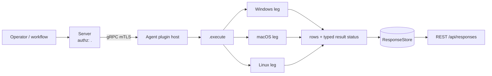

# <name>

<!-- BEGIN GENERATED: plugin-doc-gen header -->
| | |
|---|---|
| **What it does** | <descriptor description> |
| **Version** | <version> · first commit <date> |
| **Kind** | Collector · read-only · on-demand |
| **Platforms** | Windows ✅ · macOS 🟡 constrained · Linux ⛔ unsupported |
| **Actions** | `<action>` (definition `<id>`) |
| **Security** | securable `<Securable>` · operation <Read> · risk <Low> · dispatch <ReadOnly> · approval gate <none> |
| **Roles** | execute: <roles> · author: <roles> |
<!-- END GENERATED -->

## How it works

<5–10 lines, present tense. What each action reads or changes, in order. What it deliberately is not.>

## OS capability

<!-- BEGIN GENERATED: plugin-doc-gen capability -->
| Action | Windows | macOS | Linux |
|---|---|---|---|
| `<action>` | ✅ supported · rung 1 · <mechanism> | 🟡 constrained · rung 1 · <mechanism> | ⛔ unsupported |

**Declared limits per leg** (descriptor fallback text, verbatim):

- **`<action>` / <OS>** — <fallback>
<!-- END GENERATED -->

## Privileges and prerequisites

| OS | Runs as | Extra grant needed | Measured | If the read is refused |
|---|---|---|---|---|
| Windows | <account> | <grant or none> | <date, host, account> | <status and row> |
| macOS | <account> | <grant or none> | <date, host, account> | <status and row> |
| Linux | <account> | <grant or none> | <date, host, account> | <status and row> |

<Binaries, subprocesses, network: name them, or "none".>

## Data contract

### Inputs

<!-- BEGIN GENERATED: plugin-doc-gen inputs -->
| Definition | Parameter | Type | Required | Default | Description |
|---|---|---|---|---|---|
<!-- END GENERATED -->

### Outputs

<One paragraph: row format and the placeholder or empty-result convention.>

<!-- BEGIN GENERATED: plugin-doc-gen outputs -->
**`<definition id>` — `<col1>|<col2>|…`**

| Field | Type | Values | Available | Example | Description |
|---|---|---|---|---|---|
<!-- END GENERATED -->

### Result status

| Status | Completeness | Provenance | When |
|---|---|---|---|
| `OK` | — | — | <when> |

### Where the data goes

- **Instruction result.** <store, retention, API>
- **Not consumed by** <daily-sync, TAR, DEX, metrics>.
- **Siblings:** <related definitions>.

## Sample output

<!-- BEGIN GENERATED: plugin-doc-gen samples -->
<!-- END GENERATED -->

## Caveats and known gaps

1. **<lead>.** <one or two sentences>

## Source and tests

<!-- BEGIN GENERATED: plugin-doc-gen source -->
<!-- END GENERATED -->
